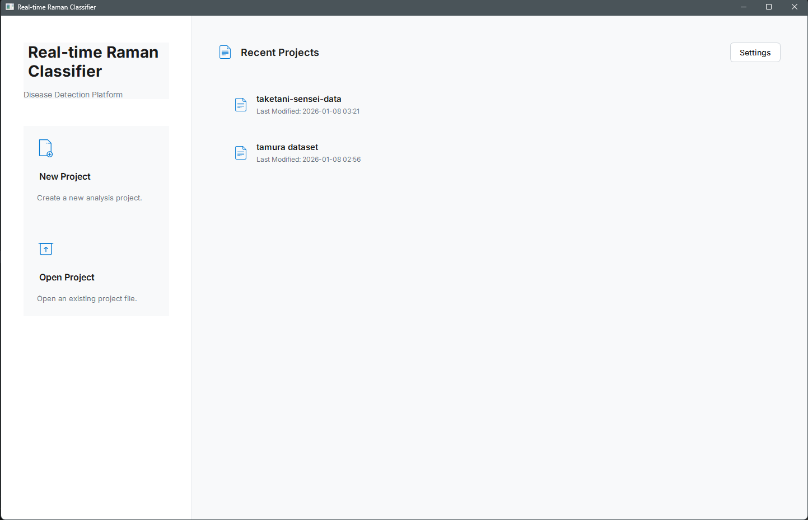
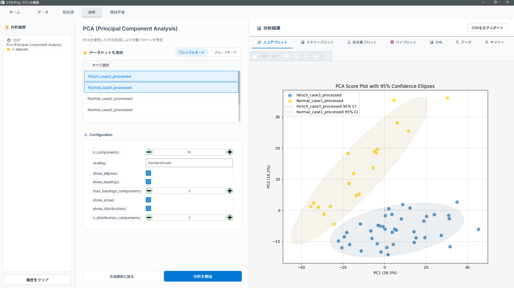

# Raman Spectroscopy Analysis Application

[](LICENSE)
[](https://www.python.org/downloads/)
[](https://www.qt.io/qt-for-python)
[](https://github.com/zerozedsc/Raman-Spectroscopy-Analysis-Application)

<div align="center">
  
  
  *A comprehensive desktop application for real-time Raman spectroscopy classification and disease detection*
</div>

---

## 🌐 Language / 言語

📖 **[Read in English](readme/README_EN.md)** | **[日本語で読む](readme/README_JA.md)**

---

## 🎯 Overview

An open-source, cross-platform desktop application designed for **real-time Raman spectroscopy classification** with focus on **disease detection** in clinical settings. Developed as part of a final year project at the **University of Toyama**, under the **Laboratory for Clinical Photonics and Information Engineering**.

### ✨ Key Highlights

- 🔬 **Comprehensive Preprocessing Pipeline** - 40+ methods including advanced algorithms for MGUS/MM classification
- 📊 **Real-Time Analysis** - Interactive visualization and classification with machine learning integration
- 🎨 **Modern GUI** - Intuitive PySide6/Qt6 interface with multi-language support (English/Japanese)
- 🧪 **Research-Grade** - Validated parameter constraints based on peer-reviewed literature
- 🚀 **Production Ready** - Portable executables and professional installer for clinical deployment
- 🌍 **Open Source** - MIT License, welcoming contributions from the research community

<div align="center">
  
</div>

---

## 🔬 Research Context

### Academic Information

**Project Title:** Real-Time Raman Spectroscopy Classification Software for Disease Detection  
**Institution:** University of Toyama (富山大学)  
**Laboratory:** [Clinical Photonics and Information Engineering](http://www3.u-toyama.ac.jp/medphoto/)  
**Student ID:** 12270294  
**Student:** Muhamad Helmi bin Rozain

### Supervisors

- **大嶋　佑介** (Oshima Yusuke)
- **竹谷　皓規** (Taketani Akinori)

### Project Background

Current challenges in Raman spectroscopy analysis:
- ❌ Manual processing required using MATLAB or Python scripts
- ❌ Existing software for medical/biological applications are proprietary or require expensive licenses
- ❌ Limited availability of open-source GUI applications for spectral analysis and disease prediction

### Project Objectives

1. **Analysis Functionality Implementation**
   - Develop spectral processing and classification algorithms
   - Enable users to configure custom preprocessing pipelines
   - Support both machine learning and deep learning models

2. **Software Development**
   - Create user-friendly graphical interface for researchers and medical professionals
   - Implement real-time processing capabilities
   - Ensure cross-platform compatibility

3. **Explainability & Interpretability**
   - Provide detailed, actionable insights for research and medical analysis
   - Implement visualization tools for spectral features and classification results
   - Support clinical decision-making workflows

<div align="center">
  
</div>

---

## 🚀 Quick Start

### Installation

```bash
# Clone the repository
git clone https://github.com/zerozedsc/Raman-Spectroscopy-Analysis-Application.git
cd Raman-Spectroscopy-Analysis-Application

# Install dependencies using UV package manager (recommended)
pip install uv
uv venv
uv pip install -e .

# Or use traditional pip
python -m venv .venv
source .venv/bin/activate  # On Windows: .venv\Scripts\activate
pip install -r requirements.txt

# Run the application
uv run python main.py
# Or: python main.py
```

### Portable Version (Windows)

For clinical deployment, download the pre-built portable executable:
- No installation required
- Single `.exe` file (>375 MB)
- All dependencies bundled
- [Download Latest Release](https://github.com/zerozedsc/Raman-Spectroscopy-Analysis-Application/releases)

---

## 📚 Documentation

Comprehensive documentation is available in both **English** and **Japanese**:

- 📖 **[Complete English Documentation](readme/README_EN.md)**
  - Detailed installation guide
  - Feature descriptions and usage
  - Development setup and contribution guidelines
  - API reference and architecture

- 📖 **[Complete Japanese Documentation](readme/README_JA.md)** (日本語版ドキュメント)
  - インストールガイド
  - 機能説明と使い方
  - 開発環境のセットアップ
  - API リファレンスとアーキテクチャ

---

## 🎯 Core Features

### 🔬 Preprocessing Pipeline
- **40+ Processing Methods** including research-validated algorithms
- **Baseline Correction:** ASLS, Polynomial, IASLS, Butterworth High-Pass
- **Normalization:** Vector, Quantile, Probabilistic Quotient (PQN), Rank Transform
- **Feature Engineering:** Peak-Ratio extraction for MGUS/MM classification
- **Deep Learning:** Convolutional Autoencoder (CDAE) for unified denoising/baseline removal
- **Real-Time Preview** with intelligent auto-focus

<div align="center">
  
</div>

### 📊 Analysis & Visualization
- **Exploratory Analysis:** PCA, t-SNE, UMAP with confidence ellipses
- **Statistical Testing:** correlation analysis
- **Interactive Plots:** Matplotlib integration with zoom, pan, and export
- **Multi-Tab Results:** Organized visualization of analysis outputs

### 🎨 User Interface
- **Modern Qt6 Design** with responsive layout
- **Multi-Language Support** (English/Japanese)
- **Project Management** system with recent projects sidebar
- **Batch Processing** capabilities for large datasets
- **Parameter Hints** based on research literature

---

## 🤝 Contributing

We welcome contributions from the research community! This project is open for:

- 🐛 Bug reports and fixes
- ✨ Feature requests and implementations
- 📖 Documentation improvements
- 🌍 Translations to additional languages
- 🔬 New preprocessing methods and algorithms
- 🎨 UI/UX enhancements

### How to Contribute

1. **Fork the Repository**
   ```bash
   git clone https://github.com/YOUR_USERNAME/Raman-Spectroscopy-Analysis-Application.git
   ```

2. **Create a Feature Branch**
   ```bash
   git checkout -b feature/your-feature-name
   ```

3. **Make Your Changes**
   - Follow the [Development Guidelines](.AGI-BANKS/DEVELOPMENT_GUIDELINES.md)
   - Add tests for new features
   - Update documentation

4. **Submit a Pull Request**
   - Describe your changes clearly
   - Reference any related issues
   - Ensure all tests pass

For detailed contribution guidelines, see:
- 📖 [English Contribution Guide](readme/README_EN.md#contributing)
- 📖 [日本語貢献ガイド](readme/README_JA.md#contributing)

---

## 📄 License

This project is licensed under the **MIT License** - see the [LICENSE](LICENSE) file for details.

```
MIT License

Copyright (c) 2024-2026 Muhamad Helmi bin Rozain
Laboratory for Clinical Photonics and Information Engineering
University of Toyama

Permission is hereby granted, free of charge, to any person obtaining a copy
of this software and associated documentation files...
```

---

## 🙏 Acknowledgments

### Academic Support
- **University of Toyama** - Research facilities and support
- **Laboratory for Clinical Photonics and Information Engineering** - Guidance and resources
- **Supervisors:** 大嶋　佑介 and 竹谷　皓規 - Project mentorship

### Open Source Community
- **PySide6/Qt** - Cross-platform GUI framework
- **matplotlib** - Scientific visualization
- **scikit-learn** - Machine learning algorithms
- **RamanSPy** - Raman spectroscopy processing library

### Research References
This project implements methods from:
- Bolstad et al. (2003) - Quantile Normalization
- Dieterle et al. (2006) - Probabilistic Quotient Normalization
- Deeley et al. (2010) - Peak-Ratio Feature Engineering
- Vincent et al. (2010) - Denoising Autoencoders
- And many more cited in the documentation

---

## 📞 Contact & Support

### Project Maintainer
- **Muhamad Helmi bin Rozain**
- **Email:** [Contact via GitHub](https://github.com/zerozedsc)
- **Laboratory:** [Clinical Photonics and Information Engineering](http://www3.u-toyama.ac.jp/medphoto/)

### Reporting Issues
- 🐛 **Bug Reports:** [GitHub Issues](https://github.com/zerozedsc/Raman-Spectroscopy-Analysis-Application/issues)
- 💡 **Feature Requests:** [GitHub Discussions](https://github.com/zerozedsc/Raman-Spectroscopy-Analysis-Application/discussions)
- 📧 **Security Issues:** Contact maintainer directly

### Community
- 💬 **Discussions:** [GitHub Discussions](https://github.com/zerozedsc/Raman-Spectroscopy-Analysis-Application/discussions)
- 📚 **Documentation:** [Wiki](https://github.com/zerozedsc/Raman-Spectroscopy-Analysis-Application/wiki)
- 🌟 **Star this repo** if you find it useful!

---

## 📊 Project Status

- ✅ **Core Features:** Complete and tested
- ✅ **Preprocessing Pipeline:** 40+ methods implemented
- ✅ **GUI:** Fully functional with multi-language support
- ✅ **Build System:** Portable and installer distributions ready
- 🔄 **Machine Learning:** Integration ongoing
- 🔄 **Real-Time Analysis:** Hardware integration in progress
- 📝 **Documentation:** Comprehensive guides in EN/JA

---

## 🌟 Citation

If you use this software in your research, please cite:

```bibtex
@software{helmi2025raman,
  author = {Rozain, Muhamad Helmi bin},
  title = {Raman Spectroscopy Analysis Application: Real-Time Classification Software for Disease Detection},
  year = {2025},
  publisher = {GitHub},
  url = {https://github.com/zerozedsc/Raman-Spectroscopy-Analysis-Application},
  institution = {University of Toyama, Laboratory for Clinical Photonics and Information Engineering}
}
```

---

<div align="center">
  <p>
    <strong>Developed for the ease of Raman Spectroscopy Analysis Research</strong>
  </p>
  <p>
    <a href="http://www3.u-toyama.ac.jp/medphoto/">Laboratory for Clinical Photonics and Information Engineering</a> • 
    <a href="https://www.u-toyama.ac.jp/">University of Toyama</a>
  </p>
  <p>
    <strong>富山大学 臨床光情報工学研究室</strong>
  </p>
</div>

---

## Recent Updates (Latest Session)

### Code Quality Improvements ✅
- **Utils.py Cleanup**: Removed unused functions (`validate_raman_data_integrity`, `get_raman_data_summary`) and unused imports
- **Debug Print Removal**: Systematically removed 58+ debug print statements across 14 files while preserving functional logging
- **Syntax Fixes**: Fixed indentation errors in `configs.py` and improved code structure
- **Application Testing**: Verified full functionality with successful preprocessing pipeline operation

### Parameter Constraint Enhancements ✅
- **Research-Based Updates**: Updated parameter constraints based on scientific literature from SciPy, scikit-learn, and spectroscopy best practices
- **Expanded Ranges**: Increased maximum limits for Savitzky-Golay window length (51→101) and Gaussian kernels based on research
- **Interdependent Validation**: Added validation for parameter relationships (e.g., window length vs polynomial order)
- **Use-Case Suggestions**: Implemented research-backed parameter suggestions for biological, material science, and noisy data scenarios

## Key Features

### 🔬 **Preprocessing Pipeline**
- **Baseline Correction**: ASLS, polynomial, and IASLS methods with research-validated parameter ranges
- **Spike Removal**: Gaussian and median filtering for cosmic ray removal
- **Normalization**: Vector normalization (L1, L2, max) and MinMax scaling
- **Derivatives**: Savitzky-Golay filtering with optimized window sizes and polynomial orders
- **Calibration**: Wavenumber shift and stretch correction

### 📊 **Data Management**
- **Project System**: Organize datasets in structured projects with automatic persistence
- **Data Loading**: Support for various spectral data formats
- **Real-time Visualization**: Interactive matplotlib integration with preprocessing preview

### 🎯 **Machine Learning**
- **Model Training**: Support for classification and regression models
- **Feature Engineering**: Automated feature extraction from preprocessed spectra
- **Validation**: Cross-validation and performance metrics

### 🌐 **User Experience**
- **Multi-language Support**: English and Japanese localization
- **Responsive UI**: Modern Qt interface with tabbed workflow
- **Parameter Guidance**: Research-based hints and constraints for all preprocessing parameters

## Technical Architecture

### Core Components
- **Main Application**: `main.py` - Application entry point and window management
- **Utils Module**: `utils.py` - Global instances and shared utilities (cleaned and optimized)
- **Preprocessing**: `functions/preprocess/` - Comprehensive preprocessing pipeline with validated constraints
- **UI Components**: `components/` - Reusable widgets and specialized components
- **Configuration**: `configs/` - Application settings and styling management

### Global State Management
- **RAMAN_DATA**: In-memory spectral data dictionary
- **PROJECT_MANAGER**: File I/O and project persistence
- **LOCALIZEMANAGER**: Multi-language string management
- **CONFIGS**: Application-wide configuration settings

## Dependencies

### Core Framework
- **PySide6**: Qt-based GUI framework
- **ramanspy**: Specialized Raman spectroscopy processing library
- **matplotlib**: Scientific plotting and visualization
- **pandas**: Data manipulation and analysis
- **numpy**: Numerical computing
- **scikit-learn**: Machine learning algorithms

### Development Tools
- **UV Package Manager**: Modern Python dependency management
- **Logging System**: Comprehensive application logging

## Research-Based Parameter Validation

The application now includes scientifically-validated parameter constraints based on:
- **SciPy Signal Processing Documentation**: Savitzky-Golay filter best practices
- **Scikit-learn Preprocessing Standards**: Normalization and scaling methods
- **Spectroscopy Literature**: Raman-specific preprocessing recommendations

### Example Parameter Ranges (Research-Validated)
- **Savitzky-Golay Window Length**: 3-101 (expanded from 3-51 based on research)
- **Baseline ASLS Lambda**: 1e3-1e10 (expanded from 1e3-1e9)
- **Spike Detection Thresholds**: 1.0-10.0 standard deviations
- **Polynomial Orders**: 1-10 with typical ranges 2-6

## Getting Started

1. **Install Dependencies**: Use UV package manager for dependency installation
2. **Launch Application**: Run `python main.py`
3. **Create Project**: Use the home screen to create a new analysis project
4. **Load Data**: Import your Raman spectral data
5. **Preprocess**: Apply research-validated preprocessing steps
6. **Analyze**: Perform machine learning analysis on processed data

## Code Quality Standards

This project maintains high code quality through:
- **No Debug Prints**: All debug statements removed, proper logging used
- **Parameter Validation**: Research-backed constraints for all preprocessing parameters
- **Clean Architecture**: Modular design with clear separation of concerns
- **Comprehensive Testing**: Application functionality verified at each stage

## Contributing

When contributing to this project:
1. Follow the established architecture patterns
2. Use the research-validated parameter constraints
3. Maintain the logging system (no debug prints)
4. Test preprocessing pipeline functionality
5. Update documentation for significant changes

## Project Status

**Current State**: Production-ready with recent quality improvements
- ✅ Code cleanup completed
- ✅ Parameter constraints updated with research findings  
- ✅ Application functionality verified
- ✅ Documentation updated

**Next Steps**: Continue feature development with maintained code quality standards
