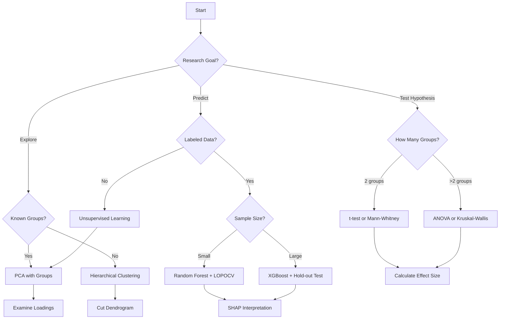

# Analysis Methods Reference

This comprehensive reference documents all analysis methods available in the Raman Spectroscopy Analysis Application, including preprocessing algorithms, exploratory analysis, statistical tests, and machine learning methods.

## Purpose of This Reference

Each method is documented with:
- **Purpose** - What the method does and when to use it
- **Theory** - Brief explanation of the underlying algorithm
- **Parameters** - Complete parameter reference with recommendations
- **Interpretation Guide** - How to understand and report results
- **Examples** - Practical usage examples
- **Common Issues** - Troubleshooting and limitations
- **References** - Primary literature citations

## Method Categories

### [Preprocessing Methods](preprocessing.md)

**40+ methods for spectral preprocessing:**

| Category                | Methods                                                 | Purpose                        |
| ----------------------- | ------------------------------------------------------- | ------------------------------ |
| **Baseline Correction** | AsLS, AirPLS, Polynomial, Whittaker, FABC, Butterworth  | Remove fluorescence background |
| **Smoothing**           | Savitzky-Golay, Gaussian, Moving Average, Median Filter | Reduce noise                   |
| **Normalization**       | Vector, Min-Max, Area, SNV, MSC, Quantile, PQN          | Scale spectra                  |
| **Derivatives**         | 1st, 2nd order Savitzky-Golay                           | Enhance peaks                  |
| **Feature Engineering** | Peak Ratio, Wavelet Transform, Rank Transform           | Extract features               |
| **Advanced**            | CDAE (Deep Learning), MCR-ALS, NMF                      | Denoising and decomposition    |

→ [Complete Preprocessing Reference](preprocessing.md)

### [Exploratory Analysis](exploratory.md)

**Unsupervised methods for data exploration:**

| Method                      | Purpose                                          | When to Use                   |
| --------------------------- | ------------------------------------------------ | ----------------------------- |
| **PCA**                     | Dimensionality reduction, variance visualization | First step for all analyses   |
| **UMAP**                    | Non-linear manifold learning                     | Complex high-dimensional data |
| **t-SNE**                   | Non-linear clustering visualization              | Identifying subgroups         |
| **Hierarchical Clustering** | Dendrogram-based grouping                        | Unknown group structure       |
| **K-means Clustering**      | Partition-based clustering                       | Known number of clusters      |

→ [Complete Exploratory Analysis Reference](exploratory.md)

### [Statistical Methods](statistical.md)

**Hypothesis testing and correlation analysis:**

| Method                   | Purpose                      | Data Type                                        |
| ------------------------ | ---------------------------- | ------------------------------------------------ |
| **Pairwise Tests**       | Compare two groups           | t-test (normal), Mann-Whitney (non-parametric)   |
| **ANOVA**                | Compare multiple groups      | F-test (normal), Kruskal-Wallis (non-parametric) |
| **Correlation Analysis** | Find relationships           | Pearson, Spearman, Kendall                       |
| **Band Ratio Analysis**  | Calculate biochemical ratios | Protein/Lipid, Amide I/II, etc.                  |
| **Peak Detection**       | Identify significant peaks   | Automatic peak finding                           |

→ [Complete Statistical Methods Reference](statistical.md)

### [Machine Learning](machine-learning.md)

**Supervised classification algorithms:**

| Algorithm                        | Type              | Best For                       |
| -------------------------------- | ----------------- | ------------------------------ |
| **Support Vector Machine (SVM)** | Margin-based      | High-dimensional, small sample |
| **Random Forest**                | Ensemble tree     | Robust, interpretable          |
| **XGBoost**                      | Gradient boosting | High accuracy, large datasets  |
| **Logistic Regression**          | Linear            | Baseline, interpretability     |

**Note**: Multi-Layer Perceptron (MLP) and PLS-DA are planned for future releases.

**Validation Methods:**
- Stratified K-Fold
- Leave-One-Patient-Out (LOPOCV)
- Time-series splits

**Interpretability:**
- SHAP values (feature importance)
- Permutation importance
- Partial dependence plots
- Decision boundary visualization

→ [Complete Machine Learning Reference](machine-learning.md)

## Quick Method Selector

### By Research Question

**"Are my groups different?"**
- Start with: [PCA](exploratory.md#principal-component-analysis-pca) (visual)
- Confirm with: [Statistical Tests](statistical.md#pairwise-statistical-tests) (quantitative)

**"What are the key differentiating features?"**
- Use: [Band Ratio Analysis](statistical.md#band-ratio-analysis)
- Or: {ref}`SHAP Values <shap-values>` from ML models

**"Can I predict group membership?"**
- Use: [Machine Learning](machine-learning.md) (classification)
- Validate with: {ref}`GroupKFold <groupkfold>`

**"What are the pure components in my mixture?"**
- Use: {ref}`MCR-ALS <mcr-als>` (spectral unmixing)

**"How many clusters exist in my data?"**
- Use: [Hierarchical Clustering](exploratory.md#hierarchical-clustering) (dendrogram)
- Or: {ref}`Elbow Method <elbow-method>` with K-means

### By Data Characteristics

**Small sample size (n < 30 per group)**
- Avoid: Deep learning, complex models
- Use: Random Forest, SVM with careful validation
- Validate with: LOPOCV

**Large sample size (n > 100 per group)**
- Can use: All methods, including deep learning
- Recommended: XGBoost, Neural Networks
- Validate with: Hold-out test set + cross-validation

**High class imbalance (e.g., 90% healthy, 10% disease)**
- Use: Stratified sampling, SMOTE
- Metrics: ROC-AUC, F1-score (not accuracy)
- See: [Handling Imbalance](machine-learning.md#class-imbalance)

**Multiple groups (>2)**
- Exploratory: PCA, UMAP with color-coded groups
- Statistical: ANOVA with post-hoc tests
- ML: Multi-class classification

## Method Selection Flowchart



## Preprocessing Guidelines

### Recommended Pipeline for Raman Data

**Minimum pipeline:**
```
1. Baseline Correction (AsLS or AirPLS)
2. Smoothing (Savitzky-Golay)
3. Normalization (Vector or SNV)
```

**For noisy data:**
```
1. Cosmic Ray Removal
2. Baseline Correction (AirPLS)
3. Smoothing (Savitzky-Golay, window=11)
4. Normalization (SNV)
5. Outlier Detection & Removal
```

**For classification:**
```
1. Baseline Correction (AsLS)
2. Smoothing (Savitzky-Golay, window=7)
3. Normalization (Vector)
4. (Optional) Peak Ratio Features
```

**For biomarker discovery:**
```
1. Baseline Correction (AirPLS)
2. Minimal Smoothing (window=5)
3. Normalization (SNV)
4. NO derivative (preserves peak positions)
```

See {ref}`Preprocessing: Recommended Pipelines <recommended-pipelines>` for detailed guidance.

## Validation Best Practices

### Critical Rules

1. **Never use test data for preprocessing**
   - Fit preprocessing on training data only
   - Transform test data using training parameters
   - See: {ref}`Avoiding Data Leakage <data-leakage>`

2. **Use patient-level splitting**
   - If multiple spectra per patient, keep patient's spectra together
   - Use GroupKFold with patient IDs
   - See: {ref}`GroupKFold Guide <groupkfold>`

3. **Report all metrics**
   - Accuracy, Precision, Recall, F1, ROC-AUC
   - Confusion matrix
   - Confidence intervals or standard deviations
   - See: {ref}`Reporting Results <reporting-results>`

4. **Validate preprocessing choices**
   - Test multiple preprocessing pipelines
   - Use cross-validation to select pipeline
   - Document final choices
   - See: {ref}`Preprocessing Validation <validation>`

## Parameter Selection Guides

Each method page includes:

### Parameter Tables

Example from PCA:

| Parameter    | Type | Default        | Range                              | Recommendation                                               |
| ------------ | ---- | -------------- | ---------------------------------- | ------------------------------------------------------------ |
| n_components | int  | 3              | 2-10                               | Start with 2-3 for visualization, 5-10 for detailed analysis |
| scaling      | str  | StandardScaler | StandardScaler, MinMaxScaler, None | **Always use StandardScaler** for Raman data                 |

### Visual Parameter Guides

Example effects of changing parameters, with figures showing:
- Before/after comparisons
- Parameter sweep results
- Optimal parameter ranges highlighted

### Decision Trees

For complex methods, decision trees guide parameter selection:
```
Is your data noisy?
├─ Yes → Use higher lambda in baseline correction
└─ No → Use default lambda

Are peaks sharp or broad?
├─ Sharp → Use smaller smoothing window (5-7)
└─ Broad → Use larger smoothing window (11-15)
```

## Interpretation Guides

Every method includes:

### Example Results

- Annotated figures showing typical outputs
- Good vs problematic results
- Edge cases and how to handle them

### What to Report

- Required information for publications
- Suggested figure panels
- Statistical reporting guidelines

### Common Misinterpretations

- Frequent mistakes
- How to avoid overinterpretation
- Validity checks

## Citations and References

### Using This Documentation in Publications

If you use these methods, cite:
1. **This software**:
   ```
   Rozain, M. H. (2025). Raman Spectroscopy Analysis Application.
   University of Toyama. https://github.com/zerozedsc/Raman-Spectroscopy-Analysis-Application
   ```

2. **Original method papers** (provided for each method)

3. **Key libraries**:
   - scikit-learn: Pedregosa et al., 2011
   - RamanSPy: Stevens et al., 2023
   - pybaselines: Erb et al., 2023

### Bibliography

Complete bibliography with DOIs is provided in [References](../references.md).

## Contributing Method Documentation

Want to add a new method or improve existing documentation?

1. Follow the [Contributing Guide](../dev-guide/contributing.md)
2. Include all required sections (Purpose, Theory, Parameters, etc.)
3. Provide at least one working example
4. Cite primary literature
5. Submit via pull request

See [Contributing Guide](../dev-guide/contributing.md) for details.

## Support

For method-specific questions:
- Check the [FAQ](../faq.md)
- Search [GitHub Discussions](https://github.com/zerozedsc/Raman-Spectroscopy-Analysis-Application/discussions)
- Review [Troubleshooting Guide](../troubleshooting.md)

For method requests or bug reports:
- Open an issue on [GitHub](https://github.com/zerozedsc/Raman-Spectroscopy-Analysis-Application/issues)
