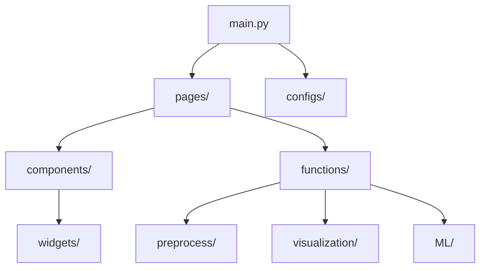
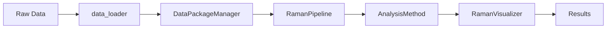

# API Documentation

This section provides comprehensive API documentation for developers who want to:
- Extend the application with new features
- Integrate the application into other workflows
- Understand the codebase architecture
- Contribute to development

## Documentation Organization

The API documentation is organized by module:

### [Core Modules](core.md)

**Application entry point and global state management**

- `main.py` - Application bootstrap and lifecycle
- `utils.py` - Global utility functions
- `configs/` - Configuration management system

### [Pages](pages.md)

**Application pages and views**

- `pages/home_page.py` - Project management interface
- `pages/data_package_page.py` - Data import and organization
- `pages/preprocess_page.py` - Preprocessing pipeline interface
- `pages/analysis_page.py` - Analysis method launcher
- `pages/machine_learning_page.py` - ML training and evaluation
- `pages/workspace_page.py` - Workspace management

### [Components](components.md)

**Reusable UI components**

- `components/app_tabs.py` - Tab management system
- `components/toast.py` - Notification system
- `components/page_registry.py` - Page registration and routing
- `components/widgets/` - Custom widget library

### [Functions](functions.md)

**Core processing algorithms**

- `functions/preprocess/` - Preprocessing methods (40+ algorithms)
- `functions/visualization/` - Plotting and visualization
- `functions/ML/` - Machine learning pipeline
- `functions/data_loader.py` - Data import and parsing
- `functions/utils.py` - Processing utilities

### [Widgets](widgets.md)

**Custom widget library**

- Parameter input widgets (sliders, spin boxes, choice lists)
- Matplotlib integration widgets
- Results display panels
- Grouping and selection widgets

## Quick Reference

### Key Classes

#### Application Core

```python
# Main application class
class RamanApp(QMainWindow):
    """Main application window with page management."""
    
# Configuration manager
class ConfigManager:
    """Load and manage application configuration."""
```

#### Data Management

```python
# Dataset container
class RamanDataset:
    """Container for spectral data with metadata."""
    
# Data package manager
class DataPackageManager:
    """Manage multiple datasets and groups."""
```

#### Preprocessing

```python
# Base preprocessing method
class PreprocessingMethod(ABC):
    """Abstract base class for preprocessing methods."""
    
# Pipeline executor
class RamanPipeline:
    """Execute preprocessing pipelines."""
```

#### Analysis

```python
# Analysis method base
class AnalysisMethod(ABC):
    """Abstract base class for analysis methods."""
    
# Visualizer
class RamanVisualizer:
    """Generate plots and visualizations."""
```

#### Machine Learning

```python
# Model trainer
class ModelTrainer:
    """Train and evaluate ML models."""
    
# Model evaluator
class ModelEvaluator:
    """Generate evaluation metrics and plots."""
```

### Common Patterns

#### Adding a New Preprocessing Method

```python
from functions.preprocess.registry import register_method
from functions.preprocess.base import PreprocessingMethod

@register_method(
    name="My Method",
    category="Baseline Correction",
    description="Brief description"
)
class MyMethod(PreprocessingMethod):
    """
    Detailed docstring following Google style.
    
    Args:
        spectrum: Input spectrum
        param1: Description
        param2: Description
        
    Returns:
        Processed spectrum
    """
    
    @staticmethod
    def get_parameters():
        """Define method parameters."""
        return {
            'param1': {'type': 'int', 'default': 10, 'range': (1, 100)},
            'param2': {'type': 'float', 'default': 0.5, 'range': (0.0, 1.0)}
        }
    
    def process(self, spectrum, **params):
        """Process spectrum."""
        # Implementation
        return processed_spectrum
```

#### Adding a New Analysis Method

```python
from pages.exploratory_analysis_page_utils.registry import register_analysis
from pages.exploratory_analysis_page_utils.base import AnalysisMethod

@register_analysis(
    name="My Analysis",
    category="Exploratory",
    description="Brief description"
)
class MyAnalysis(AnalysisMethod):
    """Detailed docstring."""
    
    def run(self, dataset, **params):
        """Execute analysis."""
        # Implementation
        return {
            'primary_figure': fig1,
            'secondary_figure': fig2,
            'data_table': df,
            'summary_text': summary,
            'raw_results': results_dict
        }
```

#### Creating Custom Widgets

```python
from PySide6.QtWidgets import QWidget
from components.widgets.parameter_widgets import create_parameter_widget

class MyCustomWidget(QWidget):
    """Custom widget with proper signals."""
    
    # Define signals
    valueChanged = Signal(object)
    
    def __init__(self, parent=None):
        super().__init__(parent)
        self.setup_ui()
        
    def setup_ui(self):
        """Build UI components."""
        # Layout and widgets
        pass
        
    def get_value(self):
        """Return current value."""
        return self._value
        
    def set_value(self, value):
        """Set value programmatically."""
        self._value = value
        self.valueChanged.emit(value)
```

## Development Setup

### Prerequisites

```bash
# Clone repository
git clone https://github.com/zerozedsc/Raman-Spectroscopy-Analysis-Application.git
cd Raman-Spectroscopy-Analysis-Application

# Install with development dependencies
uv pip install -e ".[dev]"
```

### Running Tests

```bash
# Run all tests
uv run pytest

# Run specific test file
uv run pytest tests/test_preprocessing.py

# Run with coverage
uv run pytest --cov=functions --cov-report=html
```

### Building Documentation

```bash
# Install documentation dependencies
cd docs
pip install -r requirements.txt

# Build HTML documentation
make html

# View documentation
# Open docs/_build/html/index.html in browser
```

### Code Style

We follow PEP 8 with Black formatting:

```bash
# Format code
black .

# Check formatting
black --check .

# Run linter
ruff check .
```

## Architecture Overview

### Module Dependencies



### Data Flow



### Signal/Slot Connections

Key signals used throughout the application:

```python
# Data signals
data_imported = Signal(str)  # dataset_name
data_updated = Signal(str)   # dataset_name
data_removed = Signal(str)   # dataset_name

# Processing signals
processing_started = Signal()
processing_progress = Signal(int)  # percentage
processing_finished = Signal(dict)  # results

# UI signals
parameter_changed = Signal(str, object)  # param_name, value
selection_changed = Signal(list)  # selected_items
```

## Extension Points

### Plugin System (Planned)

Future plugin system will allow:
- Custom preprocessing methods
- Custom analysis methods
- Custom visualizations
- Custom exporters

### Integration APIs

#### REST API (Planned)

Future REST API for:
- Remote processing
- Batch operations
- Integration with LIMS systems

#### Command Line Interface (Planned)

Future CLI for:
- Automated processing pipelines
- Batch analysis
- Continuous integration

## Contributing

See [Contributing Guide](../dev-guide/contributing.md) for:
- Code contribution guidelines
- Pull request process
- Testing requirements
- Documentation standards

## API Versioning

This API follows semantic versioning:
- **Major** version: Breaking changes
- **Minor** version: New features, backward compatible
- **Patch** version: Bug fixes

Current version: `1.0.0`

## Deprecation Policy

Deprecated APIs will:
1. Emit warnings for at least one minor version
2. Be documented in [Changelog](../changelog.md)
3. Suggest migration path
4. Be removed in next major version

## Support

For API-related questions:
- Check [FAQ](../faq.md)
- Search [GitHub Issues](https://github.com/zerozedsc/Raman-Spectroscopy-Analysis-Application/issues)
- Ask on [GitHub Discussions](https://github.com/zerozedsc/Raman-Spectroscopy-Analysis-Application/discussions)

## License

This API is part of the Raman Spectroscopy Analysis Application, licensed under MIT License.

See [LICENSE](https://github.com/zerozedsc/Raman-Spectroscopy-Analysis-Application/blob/main/LICENSE) for details.
