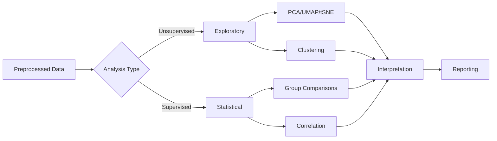

# Analysis Guide

Complete guide to exploratory and statistical analysis of Raman spectroscopy data.

## Table of Contents
- {ref}`Overview <analysis-overview>`
- {ref}`Exploratory Analysis <exploratory-analysis>`
- {ref}`Statistical Analysis <statistical-analysis>`
- {ref}`Visualization Methods <visualization-methods>`
- {ref}`Results Interpretation <results-interpretation>`
- {ref}`Export and Reporting <export-and-reporting>`

---

(analysis-overview)=
## Overview

### Analysis Workflow

After preprocessing, analysis helps you:
1. **Explore**: Visualize data structure and patterns
2. **Compare**: Test differences between groups
3. **Discover**: Identify biomarkers and correlations
4. **Validate**: Statistical significance of findings



### Analysis Page Interface


*Figure: Analysis page showing dataset selector (left), method selection tabs (top-center), parameter panel (center), and results panel (right/bottom)*

> **Note**: The analysis page features:
> - **Left Panel**: Input data selection with grouped/ungrouped mode
> - **Top-Center**: Method category tabs (Exploratory, Statistical, Visualization)
> - **Center**: Method selection and parameter configuration
> - **Right/Bottom**: Results panel with interactive plots and summary statistics

**Key Features**:
- **Stop [⏹]**: Cancel current analysis
- **Grouped Mode**: Analyze by sample groups
- **Multiple Tabs**: Results organized by analysis type
- **Interactive Plots**: Zoom, pan, and export

---
(exploratory-analysis)=
## Exploratory Analysis

### Principal Component Analysis (PCA)

**Purpose**: Reduce dimensionality while preserving variance

**When to use**:
- Visualize high-dimensional data in 2D/3D
- Identify major sources of variation
- Detect outliers
- Reduce noise
- Prepare data for ML

#### Running PCA

**Steps**:
1. Select preprocessed datasets
2. Choose grouped or ungrouped mode
3. Navigate to **Exploratory** tab
4. Select **PCA**
5. Configure parameters:
   - **N Components**: Number of PCs (2-10, default: 3)
   - **Scaling**: StandardScaler (recommended)
6. Click **[Run Analysis]**

#### Results

**Three Views**:

**1. Scores Plot** (2D or 3D)
```
PC2 (25.3%)
    ↑
    │    ○ ○ ○     ● ● ●
    │  ○ ○ ○ ○   ● ● ● ●
    │    ○ ○       ● ● ●
    └──────────────────────→ PC1 (60.0%)
    
    ○ Healthy Control
    ● Disease Group
```

**Interpretation**:
- **Separation**: Good if groups don't overlap
- **Clusters**: Indicates distinct spectral patterns
- **Outliers**: Points far from cluster centers
- **PC1 variance**: Most important direction

**2. Loadings Plot**
```
Loading values vs Wavenumber

Shows which wavenumbers contribute most to each PC
- High positive loading → Important for discrimination
- Negative loading → Inverse correlation
- Near-zero → Not important for this PC
```

**Use**: Identify biomarker peaks

**3. Scree Plot**
```
Explained Variance (%)
    ↑
 60 │ █
    │ ▐
 40 │ ▐ █
    │ ▐ ▐
 20 │ ▐ ▐ ▌ ▌ ▌
    │ ▐ ▐ ▐ ▐ ▐ ▍▍
  0 └─────────────────→
    PC1 2  3  4  5  6 ...
```

**Use**: Determine how many PCs to keep
- **Elbow point**: Where variance drops sharply
- Typically keep PCs explaining 80-95% variance

#### Interpretation Tips

**Good Separation**:
- Groups form distinct clusters
- Minimal overlap
- PC1 explains >50% variance
- Clear biomarker peaks in loadings

**Poor Separation**:
- Groups overlap completely
- Random distribution
- PC1 explains <30% variance
- May need better preprocessing or more samples

**Outliers**:
- Identify by visual inspection
- Check original spectrum
- Determine if:
  - Real biological variability
  - Technical artifact
  - Data quality issue

### UMAP (Uniform Manifold Approximation and Projection)

**Purpose**: Non-linear dimensionality reduction

**When to use**:
- PCA shows poor separation
- Non-linear relationships suspected
- Better cluster visualization
- Exploratory analysis

#### Running UMAP

**Parameters**:
- `n_neighbors`: Local neighborhood size (5-50, default: 15)
  - Lower → Fine structure
  - Higher → Global structure
- `min_dist`: Minimum distance between points (0.0-1.0, default: 0.1)
  - Lower → Tight clusters
  - Higher → Looser clusters
- `n_components`: Dimensions (2 or 3, default: 2)

**Steps**:
1. Select **UMAP** from Exploratory methods
2. Configure parameters
3. Click **[Run Analysis]**
4. View 2D/3D embedding

#### UMAP vs PCA

| Aspect              | PCA                 | UMAP             |
| ------------------- | ------------------- | ---------------- |
| **Type**            | Linear              | Non-linear       |
| **Speed**           | Fast                | Slower           |
| **Reproducibility** | Deterministic       | Stochastic       |
| **Interpretation**  | Loadings available  | No loadings      |
| **Use Case**        | General exploration | Complex patterns |

**Recommendation**: Start with PCA, use UMAP if PCA separation is poor

### t-SNE (t-Distributed Stochastic Neighbor Embedding)

**Purpose**: Visualize local structure and clusters

**When to use**:
- Cluster visualization
- Complex, non-linear relationships
- Publication figures

**Parameters**:
- `perplexity`: Balance local/global structure (5-50, default: 30)
- `n_iter`: Iterations (250-5000, default: 1000)
- `learning_rate`: Step size (10-1000, default: 200)

**Warning**: 
- Results vary between runs (stochastic)
- Distances between clusters not meaningful
- Cannot embed new data (no transform)

### Clustering Analysis

#### Hierarchical Clustering

**Purpose**: Create dendrogram showing sample relationships

**Steps**:
1. Select **Hierarchical Clustering**
2. Parameters:
   - **Linkage**: Ward, Average, Complete (default: Ward)
   - **Distance**: Euclidean, Correlation (default: Euclidean)
3. Click **[Run Analysis]**

**Result**: Dendrogram
```
Height
  ↑
  │         ┌─────────┐
  │    ┌────┤         ├────┐
  │ ┌──┤    │         │    ├──┐
  │ │  │    └─────────┘    │  │
  └─┴──┴──────────────────┴──┴───→
    Samples (colored by group)
```

**Interpretation**:
- **Tree branches**: Similar samples cluster together
- **Height**: Dissimilarity (higher = more different)
- **Cut height**: Determines number of clusters

#### K-Means Clustering

**Purpose**: Partition data into k clusters

**Steps**:
1. Select **K-Means Clustering**
2. Parameters:
   - **N Clusters**: Number of clusters (2-20)
   - **N Init**: Random initializations (10-100, default: 10)
   - **Max Iter**: Maximum iterations (100-1000, default: 300)
3. Use **Elbow Method** to determine optimal k
4. Click **[Run Analysis]**

**Elbow Plot**:
```
Inertia
  ↑
  │ ●
  │  ╲
  │   ●
  │    ╲●
  │      ●─●─●─●
  └──────────────→
     2 3 4 5 6 7 8
     Number of Clusters
```

**Optimal k**: Elbow point (e.g., k=3 in above plot)

---

(statistical-analysis)=
## Statistical Analysis

### Pairwise Group Comparisons

#### t-Test (Parametric)

**Purpose**: Compare means of two groups

**Assumptions**:
- Normal distribution
- Equal variances (or use Welch's t-test)
- Independent samples

**When to use**:
- Two groups
- Normally distributed data
- Sufficient sample size (n≥30 per group)

**Steps**:
1. Select **Statistical** tab
2. Choose **t-Test**
3. Select two groups to compare
4. Parameters:
   - **Type**: Student's or Welch's (default: Welch's)
   - **Alpha**: Significance level (0.01, 0.05, default: 0.05)
5. Click **[Run Analysis]**

**Results**:
- **p-values**: Per wavenumber
- **Effect sizes**: Cohen's d
- **Volcano plot**: -log10(p) vs effect size
- **Significant regions**: p < 0.05 highlighted

**Interpretation**:
```
p < 0.001: Highly significant (***) 
p < 0.01:  Very significant (**)
p < 0.05:  Significant (*)
p ≥ 0.05:  Not significant (ns)
```

#### Mann-Whitney U Test (Non-Parametric)

**Purpose**: Non-parametric alternative to t-test

**When to use**:
- Non-normal distribution
- Small sample sizes
- Ordinal data
- Outliers present

**Interpretation**: Same as t-test but based on rank differences

### Multi-Group Comparisons

#### ANOVA (Analysis of Variance)

**Purpose**: Compare means across multiple groups (≥3)

**Assumptions**:
- Normal distribution in each group
- Equal variances (homoscedasticity)
- Independent samples

**Steps**:
1. Select **ANOVA**
2. Choose 3+ groups
3. Parameters:
   - **Alpha**: 0.01, 0.05 (default: 0.05)
   - **Post-hoc**: Tukey HSD, Bonferroni (default: Tukey)
4. Click **[Run Analysis]**

**Results**:
- **F-statistic** per wavenumber
- **p-values**
- **Post-hoc pairwise comparisons**
- **Effect sizes** (eta-squared)

**Post-hoc Tests**: Identify which groups differ
```
Tukey HSD results:
Healthy vs Disease A: p = 0.002 (**)
Healthy vs Disease B: p = 0.123 (ns)
Disease A vs Disease B: p = 0.045 (*)
```

**Note**: ANOVA is currently disabled in the application UI. For comparing two groups, use pairwise statistical tests instead.

### Correlation Analysis

**Purpose**: Find relationships between wavenumbers

#### Pearson Correlation

**Formula**: Linear correlation coefficient
```
r = cov(X, Y) / (σ_X * σ_Y)
Range: -1 to +1
```

**Interpretation**:
- **r > 0.7**: Strong positive correlation
- **r > 0.4**: Moderate positive correlation
- **r ≈ 0**: No correlation
- **r < -0.4**: Moderate negative correlation
- **r < -0.7**: Strong negative correlation

**When to use**: Linear relationships

#### Spearman Correlation

**Non-parametric**: Based on rank correlation

**When to use**:
- Non-linear monotonic relationships
- Outliers present
- Ordinal data

**Steps**:
1. Select **Correlation Analysis**
2. Choose correlation type (Pearson or Spearman)
3. Optional: Select wavenumber region
4. Click **[Run Analysis]**

**Results**: Correlation matrix heatmap
```
        400  600  800  1000 1200 ...
  400  [1.0  0.8  0.3  0.1  -0.2]
  600  [0.8  1.0  0.5  0.2  -0.1]
  800  [0.3  0.5  1.0  0.7   0.3]
 1000  [0.1  0.2  0.7  1.0   0.5]
 1200  [-0.2 -0.1 0.3  0.5   1.0]
  ...
  
  Color scale: Red (positive) to Blue (negative)
```

**Use**: Identify correlated spectral regions

### Band Ratio Analysis

**Purpose**: Calculate ratios of specific peaks

**When to use**:
- Known biomarker ratios
- Normalize one peak by another
- Create simple interpretable features

**Steps**:
1. Select **Band Ratio Analysis**
2. Define Peak 1 range: [1000-1010 cm⁻¹]
3. Define Peak 2 range: [1200-1210 cm⁻¹]
4. Click **[Calculate Ratio]**

**Results**:
- Ratio values per spectrum
- Box plot by group
- Statistical test of group differences

**Example**: 
```
I₁₆₅₅/I₁₄₄₅ ratio (Amide I / CH₂)
- Healthy: 1.2 ± 0.1
- Disease: 0.9 ± 0.1
- p = 0.003 (**)
```

---

(visualization-methods)=
## Visualization Methods

### Interactive Heatmap

**Purpose**: Visualize all spectra as color-coded intensity map

**Features**:
- Hierarchical clustering of samples (rows)
- Dendrogram showing sample relationships
- Group coloring
- Zoom and pan

**Use**: Identify spectral patterns and outliers

### Waterfall Plot

**Purpose**: 3D-style stacked spectra visualization

**Features**:
- Offset spectra for visibility
- Color by group
- Interactive rotation (3D mode)
- Export for publication

**Use**: Publication figures, presentation

### Overlaid Spectra

**Purpose**: Plot multiple spectra on same axes

**Features**:
- Mean ± standard deviation by group
- Individual spectrum overlay (up to 100)
- Group coloring
- Legend management

**Use**: Visual comparison of groups

### Peak Scatter Plot

**Purpose**: Plot peak intensity at two wavenumbers

**Example**:
```
Peak @ 1655 cm⁻¹
    ↑
    │    ○ ○
    │  ○ ○ ○ ○
    │        ● ● ●
    │      ● ● ● ●
    │        ● ●
    └──────────────→
      Peak @ 1445 cm⁻¹
      
  ○ Healthy
  ● Disease
```

**Use**: Visualize peak ratio separation

### Correlation Matrix

**Purpose**: Heatmap of correlation coefficients

**Features**:
- Hierarchical clustering of wavenumbers
- Color scale (red = positive, blue = negative)
- Interactive tooltips
- Export as image

**Use**: Identify correlated spectral regions

---

(results-interpretation)=
## Results Interpretation

### Statistical Significance

**Multiple Testing Correction**:

When testing thousands of wavenumbers, apply correction:

**Methods**:
1. **Bonferroni**: Most conservative
   - Adjusted α = 0.05 / n_tests
   - Example: 1000 tests → α = 0.00005
2. **FDR (False Discovery Rate)**: Recommended
   - Benjamini-Hochberg procedure
   - Controls proportion of false positives
   - Less conservative than Bonferroni
3. **Permutation tests**: Data-driven
   - Randomly shuffle group labels
   - Re-compute test statistic
   - p-value = proportion of shuffles with more extreme value

**Application**: Check "Apply FDR correction" in analysis settings

### Effect Size

**Why important?**: Significance ≠ Practical importance

**Cohen's d** (for t-tests):
```
d = (mean1 - mean2) / pooled_std

Interpretation:
|d| < 0.2: Small effect
|d| < 0.5: Medium effect
|d| ≥ 0.8: Large effect
```

**Eta-squared (η²)** (for ANOVA):
```
η² = SS_between / SS_total

Interpretation:
η² < 0.01: Small effect
η² < 0.06: Medium effect
η² ≥ 0.14: Large effect
```

**Recommendation**: Report both p-value AND effect size

### Biological Interpretation

**Steps**:
1. **Identify significant peaks**
   - Use statistical tests
   - Apply multiple testing correction
   - Check effect sizes

2. **Assign peaks to molecular vibrations**
   - Consult literature
   - Use reference databases
   - Check glossary for common peaks

3. **Interpret biological meaning**
   - What molecules changed?
   - Why would they change in disease/condition?
   - Consistent with known biology?

4. **Validate findings**
   - Independent test set
   - Literature comparison
   - Biochemical validation

**Example**:
```
Significant peak @ 1655 cm⁻¹ (Amide I)
- Assignment: C=O stretch in proteins
- Increased in disease group
- Biological interpretation: Protein conformational change
- Literature: Consistent with protein misfolding in this disease
```

---

(export-and-reporting)=
## Export and Reporting

### Export Options

**Plots**:
- **PNG**: Raster image (300 DPI for publication)
- **SVG**: Vector graphics (editable in Illustrator, Inkscape)

**Data tables** (depends on the selected analysis output):
- **CSV**
- **XLSX** (Excel)
- **JSON**
- **TXT** (tab-delimited)
- **PKL** (pickle)

**Saved result folders**:
- "Export report" currently creates a folder containing:
   - `plot.png` (if available)
   - `data.csv` (if available)
   - `report.txt`

### Creating Reports

**Steps**:
1. Complete all analyses
2. Click the export/report action in the results panel
3. Choose an output folder

**Report Structure**:
```
1. Introduction
   - Dataset description
   - Preprocessing pipeline used
   
2. Methods
   - Analysis methods
   - Statistical tests
   - Parameters

3. Results
   - PCA scores plot
   - Statistical comparison results
   - Significant peaks table
   
4. Discussion
   - Interpretation
   - Biological relevance
   
5. Appendix
   - Full parameter settings
   - Additional figures
```

### Publication-Ready Figures

**Requirements**:
- **Resolution**: 300+ DPI
- **Format**: PNG (raster) or SVG (vector)
- **Fonts**: Embed or convert to paths
- **Size**: Match journal requirements
- **Color**: Check color-blind friendly palettes

**Settings**:
```
Figure → Export Settings
- DPI: 300
- Format: PNG
- Font Size: 12pt
- Line Width: 2pt
- Color Palette: Colorblind-safe
- Background: White (for print)
```

---

## Troubleshooting

### No Group Separation in PCA

**Possible Causes**:
- Groups are truly not different
- Insufficient preprocessing
- Too much noise
- Wrong groups selected

**Solutions**:
- Try different preprocessing
- Check data quality
- Use UMAP or t-SNE
- Verify group labels are correct

### Statistical Tests Show No Significance

**Possible Causes**:
- Small sample size (low power)
- High within-group variability
- Multiple testing correction too strict
- Groups not actually different

**Solutions**:
- Increase sample size
- Improve preprocessing to reduce noise
- Use less conservative correction (FDR instead of Bonferroni)
- Check effect sizes (may be significant but small)

### Analysis Takes Too Long

**Causes**:
- Large dataset (>5000 spectra)
- Complex method (UMAP, t-SNE)
- Insufficient RAM

**Solutions**:
- Use PCA instead of UMAP/t-SNE
- Subsample data for exploration
- Close other applications
- Enable batch processing

---

## See Also

- [Machine Learning Guide](machine-learning.md) - Next step: Build ML models
- [Analysis Methods Reference](../analysis-methods/index.md) - Detailed method documentation
- [Best Practices](best-practices.md) - Analysis recommendations
- {ref}`FAQ - Analysis <faq-analysis>` - Common questions

---

**Next**: [Machine Learning Guide](machine-learning.md) →
