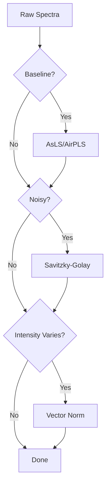
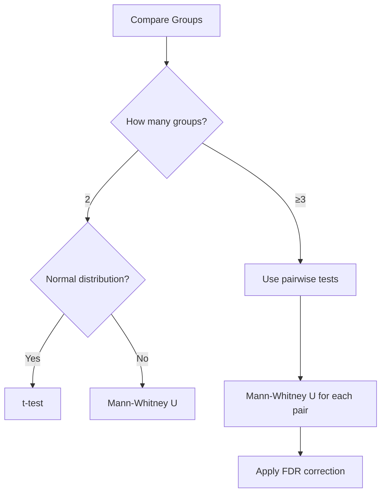

# Best Practices

Research best practices for Raman spectroscopy analysis: data quality, reproducibility, validation, and reporting standards.

## Table of Contents
- [Data Quality](#data-quality)
- [Preprocessing Strategy](#preprocessing-strategy)
- [Statistical Analysis](#statistical-analysis)
- [Machine Learning](#machine-learning)
- [Reproducibility](#reproducibility)
- [Publication and Reporting](#publication-and-reporting)

---

## Data Quality

### Sample Preparation

**Consistency is Critical**:
```
Standard Operating Procedure (SOP):
1. Sample collection protocol
2. Storage conditions (-80°C for plasma)
3. Thawing procedure (room temp, 10 min)
4. Substrate preparation
5. Drying time
6. Environmental conditions (temp, humidity)
```

**Documentation**:
- Record all parameters
- Note any deviations
- Track batch information
- Include control samples

**Quality Control Samples**:
```
Per Batch:
- Positive control (known sample)
- Negative control (blank)
- Technical replicates (n=3 minimum)
- Standard reference material
```

### Data Acquisition

**Instrument Parameters**:
```
Essential to Record:
- Laser wavelength (e.g., 785 nm)
- Laser power (e.g., 50 mW)
- Integration time (e.g., 10 s)
- Number of accumulations (e.g., 3)
- Objective magnification (e.g., 10×)
- Spectral range (e.g., 400-1800 cm⁻¹)
- Spectral resolution (e.g., 4 cm⁻¹)
```

**Keep Constant**:
- Same spectrometer for entire study
- Same acquisition parameters
- Same environmental conditions
- Same operator (if possible)

**Calibration**:
```
Frequency: Daily
Standards:
- Silicon peak at 520.7 cm⁻¹ (wavenumber)
- NIST standards (intensity)
- Polystyrene (multiple peaks)

Procedure:
1. Acquire calibration spectrum
2. Verify peak position
3. Apply correction if needed
4. Document calibration
```

### Sample Size Determination

**Minimum Recommendations**:
```
Per Group:
- Exploratory analysis: n ≥ 30
- Statistical tests: n ≥ 50
- Machine learning: n ≥ 100
- Clinical validation: n ≥ 200
```

**Power Analysis** (for statistical tests):
```python
# Example: t-test power analysis
Effect size (Cohen's d): 0.5 (moderate)
Significance level (α): 0.05
Power (1-β): 0.80

Required sample size: ~64 per group
```

**For Machine Learning**:
```
Rule of Thumb:
- 10-20 samples per feature (wavenumber)
- With 1000 wavenumbers → n ≥ 10,000 ideal
- BUT: Use dimensionality reduction (PCA)
- Practical minimum: 50-100 per class

Reality Check:
- Small studies (n=50-200): Use simple models (LR, RF)
- Medium studies (n=200-1000): Use complex models (XGBoost, SVM)
- Large studies (n>1000): Deep learning possible
```

### Data Organization

**File Naming**:
```
Good:
YYYY-MM-DD_batch_condition_replicate_ID.csv
2026-01-24_batch01_healthy_rep1_patient001.csv

Bad:
data.csv
p1.csv
20260124.csv
```

**Folder Structure**:
```
project_name/
├── raw_data/
│   ├── batch_01/
│   │   ├── healthy/
│   │   └── disease/
│   └── batch_02/
├── processed_data/
├── preprocessing_pipelines/
├── models/
├── results/
│   ├── figures/
│   └── tables/
├── documentation/
│   ├── sop.md
│   ├── notebook.md
│   └── metadata.xlsx
└── scripts/
```

**Metadata Management**:
```text
sample_id,patient_id,group,batch,acquisition_date,laser_power,integration_time,notes
S001,P001,healthy,batch01,2026-01-15,50,10,good_quality
S002,P001,healthy,batch01,2026-01-15,50,10,technical_replicate
S003,P002,disease,batch01,2026-01-16,50,10,weak_signal
```

---

## Preprocessing Strategy

### Choosing Methods

**Decision Tree**:


**Conservative Approach** (Recommended):
```
1. Baseline correction: AsLS (λ=1e5, p=0.01)
2. Light smoothing: Savitzky-Golay (window=11, order=3)
3. Normalization: Vector (L2 norm)

Why:
- Minimal information loss
- Widely accepted
- Reproducible
- Good starting point
```

**Avoid**:
- ❌ Over-smoothing (window >21)
- ❌ Multiple normalization steps
- ❌ 2nd derivative without strong justification
- ❌ Deep learning methods on small datasets
- ❌ Undocumented manual corrections

### Validation

**Visual Inspection**:
```
Check:
1. Overlay before/after preprocessing
2. Verify peaks not removed
3. Check baseline flatness
4. Compare multiple representative spectra
5. Inspect edge cases (weak signal, high noise)
```

**Quantitative Metrics**:
```
Calculate:
- SNR (Signal-to-Noise Ratio) improvement
- Peak height preservation
- Baseline level (should be near zero)
- Consistency across spectra
```

**Test on Subset**:
```
Workflow:
1. Select 20% of data randomly
2. Try different preprocessing approaches
3. Evaluate on downstream analysis (PCA, classification)
4. Choose best performing pipeline
5. Apply to full dataset
```

### Documentation

**Pipeline File**:
```json
{
  "pipeline_name": "blood_plasma_standard_v1",
  "created_date": "2026-01-24",
  "methods": [
    {
      "step": 1,
      "method": "AsLS",
      "parameters": {"lambda": 100000, "p": 0.01},
      "reason": "Remove fluorescence background"
    },
    {
      "step": 2,
      "method": "Savitzky-Golay",
      "parameters": {"window": 11, "polyorder": 3, "deriv": 0},
      "reason": "Reduce noise while preserving peaks"
    },
    {
      "step": 3,
      "method": "Vector Normalization",
      "parameters": {},
      "reason": "Normalize intensity variations"
    }
  ],
  "validation": {
    "snr_improvement": "35%",
    "peak_preservation": "98%",
    "tested_on": "20% random subset"
  }
}
```

**Lab Notebook Entry**:
```
Date: 2026-01-24
Experiment: Preprocessing optimization

Tried:
- Pipeline A: Polynomial baseline → Poor performance
- Pipeline B: AsLS (λ=1e6) → Over-correction
- Pipeline C: AsLS (λ=1e5) → Good balance ✓

Selected Pipeline C:
- AsLS (λ=1e5, p=0.01)
- SavGol (w=11, order=3)
- Vector norm

Results:
- PCA separation improved
- Classification accuracy: 85% → 92%
```

---

## Statistical Analysis

### Test Selection

**Flowchart**:


**Note**: ANOVA and Kruskal-Wallis are not currently available in the UI. For 3+ groups, use pairwise tests with multiple comparison correction.

**Check Assumptions**:
```
Normality:
- Visual: Q-Q plot, histogram
- Statistical: Shapiro-Wilk test (p > 0.05 → normal)

Equal Variance:
- Levene's test (p > 0.05 → equal variance)

Independence:
- Study design verification
- No repeated measures
```

### Multiple Testing Correction

**Problem**:
```
Testing 1000 wavenumbers at α=0.05
Expected false positives: 1000 × 0.05 = 50

Even with random data, expect ~50 "significant" results!
```

**Solutions**:
```
1. Bonferroni (most conservative):
   α_corrected = 0.05 / 1000 = 0.00005
   
2. FDR - Benjamini-Hochberg (recommended):
   Controls false discovery rate at 5%
   Less conservative than Bonferroni
   
3. Permutation tests:
   Data-driven correction
   More powerful for small samples
```

**Implementation**:
- Always report whether correction was applied
- Use FDR by default
- Use Bonferroni for confirmatory studies

### Effect Sizes

**Always Report**:
```
Example Bad:
"Peak at 1655 cm⁻¹ differs significantly between groups (p=0.003)"

Example Good:
"Peak at 1655 cm⁻¹ shows large effect (Cohen's d=0.85, 95% CI: 0.42-1.28)
with significant difference between groups (p=0.003, FDR-corrected)"
```

**Guidelines**:
```
Cohen's d:
- Small: |d| = 0.2
- Medium: |d| = 0.5
- Large: |d| = 0.8

Report:
- Point estimate
- Confidence interval (95%)
- Statistical significance
```

---

## Machine Learning

### Data Splitting

**Critical Rules**:
```
1. Split BEFORE any preprocessing or feature selection
2. Use patient-level splitting (not spectrum-level)
3. Never touch test set until final evaluation
4. Document random seed for reproducibility
```

**Recommended Split**:
```
Total Data
├── Training (70%)
│   ├── Used for: Model training, hyperparameter tuning, CV
│   └── Preprocessing fit on training only
├── Validation (15%) [Optional]
│   └── Used for: Model selection, early stopping
└── Test (15-30%)
    └── Used for: Final evaluation ONCE
```

**Patient-Level Splitting**:
```python
# Good: Patient-level
patients = get_unique_patients(data)
train_patients, test_patients = train_test_split(
    patients, test_size=0.3, stratify=patient_labels, random_state=42
)

# Bad: Spectrum-level (data leakage!)
train_spectra, test_spectra = train_test_split(
    spectra, test_size=0.3
)  # Patient spectra in both train and test!
```

### Cross-Validation Strategy

**GroupKFold (Required)**:
```python
from sklearn.model_selection import GroupKFold

# Ensure all spectra from one patient stay together
cv = GroupKFold(n_splits=5)
for train_idx, val_idx in cv.split(X, y, groups=patient_ids):
    # Train on train_idx, validate on val_idx
    # No patient appears in both
```

**Stratified K-Fold** (If no patient grouping):
```python
from sklearn.model_selection import StratifiedKFold

# Maintains class balance in each fold
cv = StratifiedKFold(n_splits=5, shuffle=True, random_state=42)
```

### Feature Selection

**Timing Matters**:
```
Wrong:
1. Select features on full dataset
2. Split data
3. Train model
→ Data leakage! Features selected using test set info

Correct:
1. Split data
2. Select features on training set only
3. Apply same selection to test set
4. Train model
```

**Methods**:
```
1. Variance threshold:
   - Remove low-variance wavenumbers
   - Threshold: <1% of max variance
   
2. Univariate selection:
   - t-test or ANOVA per wavenumber
   - Keep top k most significant
   
3. Model-based:
   - Random Forest feature importance
   - Keep top k features
   
4. Recursive Feature Elimination (RFE):
   - Iteratively remove least important features
   - Expensive but thorough
```

**How Many Features?**:
```
Rule of Thumb: n_features ≤ n_samples / 10

Examples:
- 100 samples → Select ≤10 features
- 500 samples → Select ≤50 features
- 1000 samples → Can use more features
```

### Model Selection

**Start Simple**:
```
1. Baseline: Logistic Regression
2. Next: Random Forest (fast, robust)
3. Then: XGBoost (if RF works)
4. Advanced: SVM, Neural Networks (if needed)
```

**Hyperparameter Tuning**:
```
Workflow:
1. Use defaults for initial assessment
2. If promising, run grid search on training set
3. Use nested CV:
   - Outer loop: Performance estimation
   - Inner loop: Hyperparameter tuning
4. Evaluate best model on test set
```

**Avoid**:
- Tuning on test set
- Many model types without justification
- Complex models on small data
- Claiming "best model" without proper comparison

### Validation Requirements

**Minimum Standards**:
```
For Publication:
1. Independent test set (held out from start)
2. Patient-level cross-validation (GroupKFold)
3. Multiple performance metrics (not just accuracy)
4. Confidence intervals (bootstrap or CV)
5. Feature importance analysis
6. Model interpretation (SHAP, etc.)
```

**Gold Standard**:
```
1. Training/test split
2. Cross-validation on training set
3. External validation (different hospital/cohort)
4. Temporal validation (future patients)
5. Prospective validation (real-time use)
```

---

## Reproducibility

### Code and Environment

**Version Control**:
```
Use Git:
- Track all code changes
- Document analysis steps
- Enable rollback
- Collaborate safely

Commit Messages:
"Add AsLS baseline correction to preprocessing pipeline"
"Update RF hyperparameters based on grid search results"
```

**Environment Management**:
```bash
# Create reproducible environment
uv venv
source .venv/bin/activate  # Linux/Mac
.venv\Scripts\activate  # Windows

# Record dependencies
uv pip freeze > requirements.txt

# Include versions
numpy==1.24.3
scikit-learn==1.3.0
pandas==2.0.3
```

**Random Seeds**:
```python
# Set ALL random seeds
import numpy as np
import random
from sklearn.model_selection import train_test_split

RANDOM_SEED = 42

np.random.seed(RANDOM_SEED)
random.seed(RANDOM_SEED)

# Use in all functions
train_test_split(X, y, random_state=RANDOM_SEED)
```

### Documentation

**Lab Notebook** (Digital or Physical):
```
Per Experiment:
- Date and time
- Objective
- Methods used
- Parameters
- Results
- Observations
- Next steps

Example:
---
Date: 2026-01-24 14:30
Objective: Test preprocessing pipelines
Methods: AsLS baseline correction with varying λ
Parameters: λ ∈ {1e4, 1e5, 1e6, 1e7}
Results: λ=1e5 gives best balance (see plot_baseline_comparison.png)
Next: Apply to full dataset and proceed to classification
---
```

**README Files**:
```markdown
# Project: Blood Plasma Disease Classification

## Overview
Raman spectroscopy-based classification of disease states in blood plasma.

## Data
- Location: data/raw/batch_01/
- Samples: 143 (75 healthy, 68 disease)
- Acquisition: 2026-01-15 to 2026-01-20
- Spectrometer: RamanSpecPro 5000

## Preprocessing
Pipeline: preprocessing/standard_pipeline_v1.json
- AsLS (λ=1e5, p=0.01)
- Savitzky-Golay (w=11, order=3)
- Vector normalization

## Results
Best model: Random Forest (see models/rf_best.pkl)
Test accuracy: 92.3% (95% CI: 86.1-96.8%)

## Citation
[Include publication info when available]
```

**Method Descriptions**:
```
Write as if for a peer reviewer:

"Baseline correction was performed using asymmetric least squares (AsLS) 
with λ=10⁵ and p=0.01, followed by Savitzky-Golay smoothing (window=11, 
polynomial order=3). Spectra were normalized using L2 norm. This pipeline 
was selected based on optimization on a 20% random subset of the training 
data, evaluated by classification accuracy and signal-to-noise ratio 
improvement."
```

---

## Publication and Reporting

### Figures

**Quality Standards**:
```
Resolution: 300 DPI minimum (600 DPI for line art)
Format: TIFF, PDF, or EPS (vector when possible)
Size: Match journal requirements
Fonts: Readable (≥8pt), consistent across figures
Colors: Colorblind-friendly palette
```

**Good Figure Practices**:
```
Do:
✓ Clear axis labels with units
✓ Legends with all necessary info
✓ Error bars (SD, SEM, or CI)
✓ Statistical significance marked
✓ High contrast
✓ Consistent style across all figures

Don't:
✗ 3D plots (hard to read)
✗ Rainbow color maps (colorblind issue)
✗ Cluttered plots
✗ Missing error bars
✗ Unlabeled axes
```

### Tables

**Results Table Example**:
```
Table 1. Classification Performance

| Model         | Accuracy (%) | Sensitivity (%) | Specificity (%) | AUC   |
| ------------- | ------------ | --------------- | --------------- | ----- |
| Logistic Reg  | 78.3 ± 4.2   | 75.1 ± 5.3      | 81.2 ± 4.8      | 0.862 |
| Random Forest | 92.3 ± 3.1   | 90.5 ± 4.1      | 93.8 ± 3.5      | 0.967 |
| XGBoost       | 93.1 ± 2.8   | 91.2 ± 3.9      | 94.7 ± 3.1      | 0.972 |
| SVM (RBF)     | 89.4 ± 3.5   | 87.3 ± 4.5      | 91.1 ± 3.9      | 0.943 |

Values: Mean ± SD from 5-fold cross-validation.
AUC: Area under ROC curve.
Best performance in bold.
```

### Methods Section

**Structure**:
```
1. Sample Collection and Preparation
   - Describe protocol in detail
   - Include all parameters
   - Reference standard protocols if applicable

2. Data Acquisition
   - Instrument specifications
   - Acquisition parameters
   - Calibration procedures
   - Quality control measures

3. Data Preprocessing
   - Methods used (with citations)
   - Parameters (exact values)
   - Validation approach
   - Software used (with version)

4. Analysis Methods
   - Statistical tests (assumptions checked)
   - Machine learning algorithms
   - Validation strategy (GroupKFold, etc.)
   - Hyperparameter optimization
   - Software and versions

5. Data Availability
   - Where data can be accessed
   - Code repository (GitHub)
   - Any restrictions
```

(reporting-results)=

### Results Section

**Good Practice**:
```
"Random Forest achieved the best performance with a test set accuracy 
of 92.3% (95% CI: 86.1-96.8%), sensitivity of 90.5%, and specificity 
of 93.8%. The model was trained using 5-fold cross-validation with 
patient-level splitting (GroupKFold) on 100 training samples. Feature 
importance analysis revealed that wavenumbers at 1655 cm⁻¹ (Amide I), 
1450 cm⁻¹ (CH₂), and 1200 cm⁻¹ (Amide III) contributed most to 
classification (see Figure 3). External validation on an independent 
cohort (n=43) confirmed model generalization with 91.2% accuracy."
```

### Discussion

**Address**:
```
1. Main findings
   - Put in context of literature
   - Explain biological/clinical significance

2. Comparison with previous work
   - How does your method compare?
   - What's novel?

3. Limitations
   - Sample size
   - Single center vs multi-center
   - Lack of external validation
   - Class imbalance
   - Preprocessing choices

4. Future directions
   - Larger studies
   - External validation
   - Clinical trials
   - Real-time implementation
```

### Ethical Considerations

**Required**:
```
1. Ethics approval
   - IRB/Ethics committee approval number
   - Informed consent obtained

2. Patient privacy
   - Data de-identified
   - No patient information in figures
   - Secure data storage

3. Clinical use disclaimer
   - "For research use only"
   - "Not approved for clinical diagnostics"
   - Limitations clearly stated

4. Conflicts of interest
   - Funding sources disclosed
   - Commercial interests declared
```

---

## Checklists

### Before Analysis
- [ ] Data quality checked (visual inspection, statistics)
- [ ] Metadata recorded (all acquisition parameters)
- [ ] Control samples included
- [ ] Calibration performed
- [ ] Data backed up
- [ ] File naming convention followed
- [ ] Lab notebook entry made

### Before Preprocessing
- [ ] Multiple approaches tested on subset
- [ ] Visual validation performed
- [ ] Quantitative metrics calculated
- [ ] Pipeline saved with parameters
- [ ] Documentation written

### Before Statistical Analysis
- [ ] Test assumptions checked (normality, equal variance)
- [ ] Multiple testing correction planned
- [ ] Effect sizes will be reported
- [ ] Sample size sufficient (power analysis)

### Before Machine Learning
- [ ] Data split patient-level (GroupKFold planned)
- [ ] Test set held out and not touched
- [ ] Preprocessing plan documented
- [ ] Feature selection strategy defined
- [ ] Validation strategy chosen
- [ ] Random seeds set

### Before Publication
- [ ] All analyses documented
- [ ] Code version controlled (GitHub)
- [ ] Figures publication-quality (300+ DPI)
- [ ] Tables formatted correctly
- [ ] Methods section complete and reproducible
- [ ] Data availability statement included
- [ ] Ethics approval obtained
- [ ] Author contributions defined
- [ ] Funding acknowledged
- [ ] Conflicts of interest disclosed

---

## Common Pitfalls to Avoid

(data-leakage)=

### ❌ Data Leakage
```
Wrong: Normalize all data, then split
Correct: Split first, normalize training, apply to test
```

### ❌ Spectrum-Level Splitting
```
Wrong: Random split ignoring patients
Correct: Patient-level splitting with GroupKFold
```

### ❌ Peeking at Test Set
```
Wrong: Check test performance during development
Correct: Look at test set only for final evaluation
```

### ❌ Multiple Testing Without Correction
```
Wrong: Report all p<0.05 across 1000 wavenumbers
Correct: Apply FDR correction
```

### ❌ Cherry-Picking Results
```
Wrong: Only report best-performing model
Correct: Report all tested approaches, explain choice
```

### ❌ Overfitting
```
Wrong: Complex model on small dataset
Correct: Match model complexity to sample size
```

### ❌ Missing Documentation
```
Wrong: "Preprocessed using standard methods"
Correct: "AsLS (λ=10⁵, p=0.01), then SavGol (w=11, order=3)"
```

---

## Resources

### Recommended Reading

**Raman Spectroscopy**:
1. Butler et al. (2016). Nature Protocols. "Using Raman spectroscopy to characterize biological materials"
2. Movasaghi et al. (2007). Applied Spectroscopy Reviews. "Raman Spectroscopy of Biological Tissues"

**Machine Learning**:
3. Hastie et al. (2009). "The Elements of Statistical Learning"
4. Goodfellow et al. (2016). "Deep Learning"

**Statistics**:
5. Altman & Bland (1995). BMJ. "Statistics notes" series
6. Wasserstein & Lazar (2016). Am Stat. "The ASA statement on p-values"

### Software Citations

**Always cite**:
```bibtex
@article{scikit-learn,
  title={Scikit-learn: Machine Learning in Python},
  author={Pedregosa et al.},
  journal={JMLR},
  year={2011}
}
```

---

## See Also

- [Data Import Guide](data-import.md) - Best practices for data organization
- [Preprocessing Guide](preprocessing.md) - Detailed preprocessing methods
- [Analysis Guide](analysis.md) - Statistical analysis best practices
- [Machine Learning Guide](machine-learning.md) - ML workflow and validation

---

**Complete User Guide Navigation**:
- [Interface Overview](interface-overview.md)
- [Data Import](data-import.md)
- [Preprocessing](preprocessing.md)
- [Analysis](analysis.md)
- [Machine Learning](machine-learning.md)
- **[Best Practices](best-practices.md)** ← You are here
