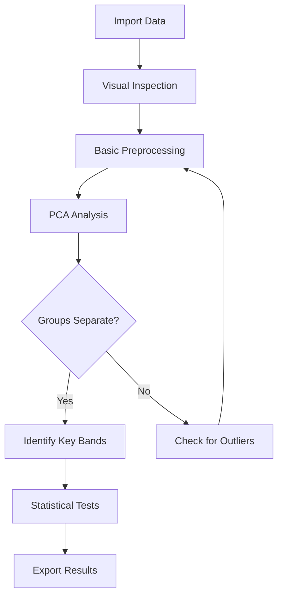
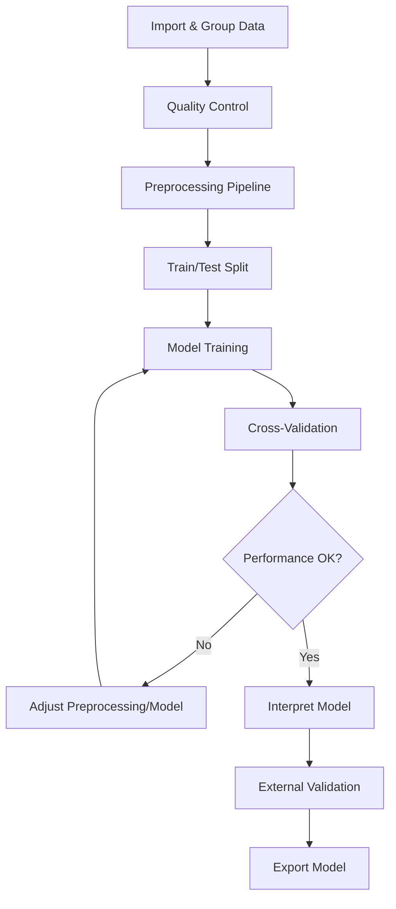
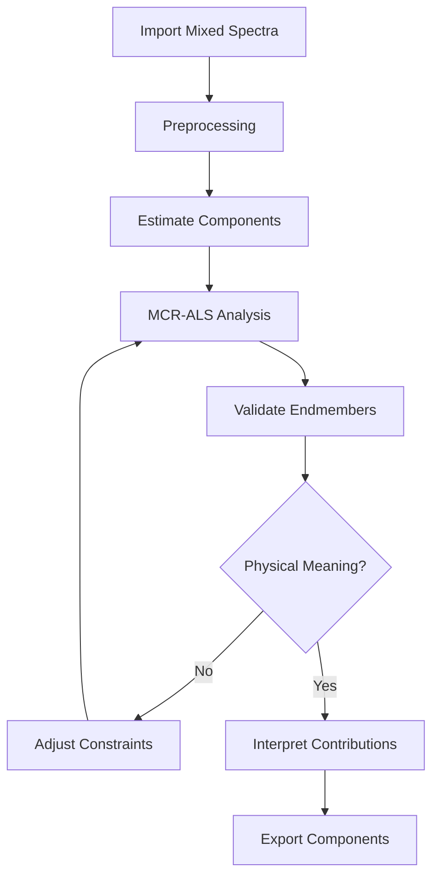

# User Guide

Welcome to the comprehensive user guide for the Raman Spectroscopy Analysis Application. This guide covers everything you need to know to effectively use the software for your research.

## Guide Structure

This user guide is organized into the following sections:

### 1. [Interface Overview](interface-overview.md)

Learn about the application's user interface, including:
- Main window layout and navigation
- Tab system (Home, Data, Preprocessing, Analysis, ML)
- Common UI elements and controls

### 2. [Data Import and Management](data-import.md)

Master data organization and import:
- Supported file formats (CSV, TXT, ASC/ASCII, PKL)
- Data structure requirements
- Creating and managing datasets
- Grouping spectra for analysis
- Metadata management
- Batch import operations

### 3. [Preprocessing Pipeline](preprocessing.md)

Build effective preprocessing workflows:
- Understanding the preprocessing pipeline
- Step-by-step preprocessing guide
- All 40+ preprocessing methods explained
- Parameter selection guidelines
- Real-time preview system
- Saving and loading pipelines
- Best practices for Raman data

### 4. [Analysis Methods](analysis.md)

Perform comprehensive spectral analysis:
- Exploratory analysis (PCA, UMAP, t-SNE, clustering)
- Statistical comparisons (t-tests, ANOVA, correlations)
- Visualization methods (heatmaps, waterfall plots)
- Band ratio analysis
- Spectral unmixing (MCR-ALS, NMF)
- Interpreting results

### 5. [Machine Learning](machine-learning.md)

Train and evaluate classification models:
- Dataset preparation
- Algorithm selection (SVM, RF, XGBoost, etc.)
- Validation strategies (GroupKFold, LOPOCV)
- Training and evaluation
- Interpreting model results (ROC, confusion matrix, SHAP)
- Exporting trained models
- Avoiding common pitfalls

### 6. [Best Practices](best-practices.md)

Learn research best practices:
- Data quality control and validation
- Avoiding data leakage
- Sample size considerations
- Publication-ready figures
- Reproducible workflows
- Documentation and record-keeping
- Common mistakes and how to avoid them

## Quick Navigation

### By Task

**I want to...**

- **Import my data** → [Data Import Guide](data-import.md)
- **Remove baseline** → [Preprocessing Guide](preprocessing.md)
- **Compare two groups** → [Analysis Guide](analysis.md)
- **Visualize group separation** → [Analysis Guide](analysis.md)
- **Train a classifier** → [Machine Learning Guide](machine-learning.md)
- **Interpret my model** → [Machine Learning Guide](machine-learning.md)
- **Export results** → [Analysis Guide](analysis.md)

### By Research Goal

**My research involves...**

- **Cancer detection** → [Best Practices](best-practices.md)
- **Multiple myeloma vs MGUS** → [Best Practices](best-practices.md)
- **Cell classification** → [Best Practices](best-practices.md)
- **Biomarker discovery** → [Analysis Guide](analysis.md)
- **Method validation** → [Best Practices](best-practices.md)

## Typical Workflows

### Workflow 1: Quality Control and Exploratory Analysis

**Recommended Sections:**
1. [Data Import](data-import.md)
2. [Preprocessing](preprocessing.md)
3. [Analysis](analysis.md)
4. [Analysis](analysis.md)

### Workflow 2: Classification Model Development

**Recommended Sections:**
1. [Data Import](data-import.md)
2. [Preprocessing](preprocessing.md)
3. [Machine Learning](machine-learning.md)
4. [Best Practices](best-practices.md)

### Workflow 3: Spectral Unmixing

**Recommended Sections:**
1. [Analysis](analysis.md)
2. [Analysis](analysis.md)

## Common Questions

### When Should I Use Each Analysis Method?

| Analysis Goal                   | Recommended Method | Section                         |
| ------------------------------- | ------------------ | ------------------------------- |
| Explore group separation        | PCA                | [Analysis Guide](analysis.md)   |
| Test if groups differ           | Statistical tests  | [Analysis Guide](analysis.md)   |
| Classify new samples            | Machine Learning   | [ML Guide](machine-learning.md) |
| Find biomarkers                 | Band ratio + stats | [Analysis Guide](analysis.md)   |
| Decompose mixtures              | MCR-ALS            | [Analysis Guide](analysis.md)   |
| Visualize high-dimensional data | UMAP or t-SNE      | [Analysis Guide](analysis.md)   |

### What Preprocessing Should I Use?

**Minimum preprocessing for Raman data:**
1. Baseline correction (AsLS or AirPLS)
2. Smoothing (Savitzky-Golay)
3. Normalization (Vector or SNV)

See [Preprocessing Guide](preprocessing.md) for specific use cases.

### How Do I Ensure Valid Results?

Key validation steps:
- **Data quality**: Remove outliers and cosmic rays
- **Preprocessing**: Validate each step with preview
- **Statistics**: Use appropriate tests and corrections
- **Machine learning**: Use proper validation (GroupKFold, external test set)
- **Reproducibility**: Document all parameters and steps

See [Best Practices](best-practices.md) for complete checklist.

## Getting Help

### Documentation Resources

- [FAQ](../faq.md) - Frequently asked questions
- [Troubleshooting](../troubleshooting.md) - Common issues and solutions
- [Analysis Methods Reference](../analysis-methods/index.md) - Detailed method documentation
- [API Documentation](../api/index.md) - For developers

### Community Support

- [GitHub Discussions](https://github.com/zerozedsc/Raman-Spectroscopy-Analysis-Application/discussions) - Ask questions
- [GitHub Issues](https://github.com/zerozedsc/Raman-Spectroscopy-Analysis-Application/issues) - Report bugs

## Video Tutorials (Coming Soon)

We're creating video tutorials for:
- Complete walkthrough of the interface
- Building preprocessing pipelines
- Performing PCA analysis with interpretation
- Training and evaluating ML models
- Real-world case studies

## Contributing to This Guide

Found an error or want to improve this guide? 

1. Visit the [GitHub repository](https://github.com/zerozedsc/Raman-Spectroscopy-Analysis-Application)
2. Fork the repository
3. Edit the relevant markdown file in `docs/user-guide/`
4. Submit a pull request

Your contributions help the entire community!
