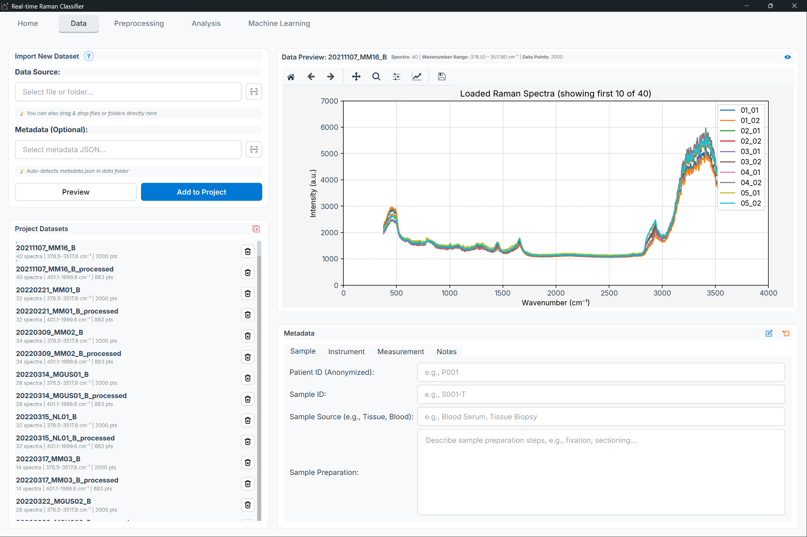
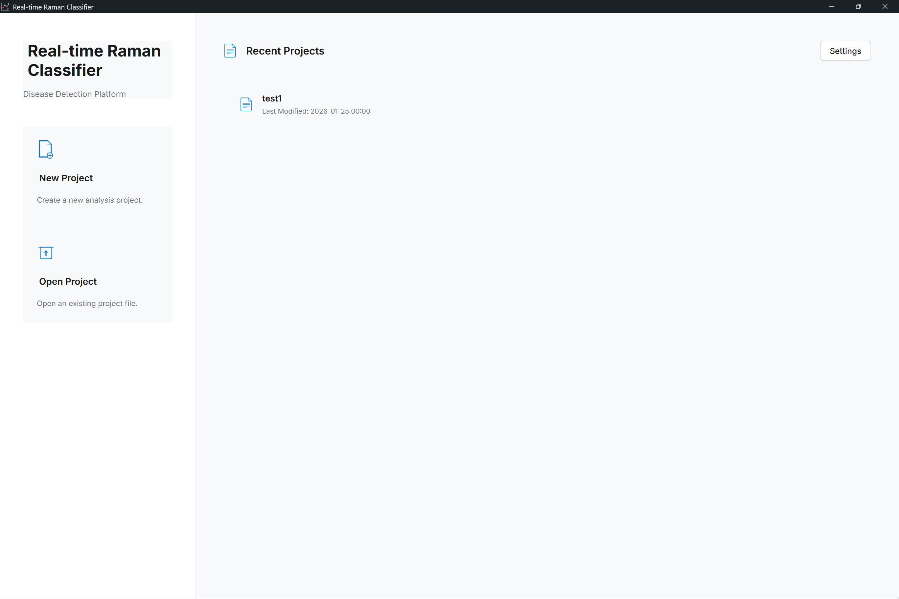
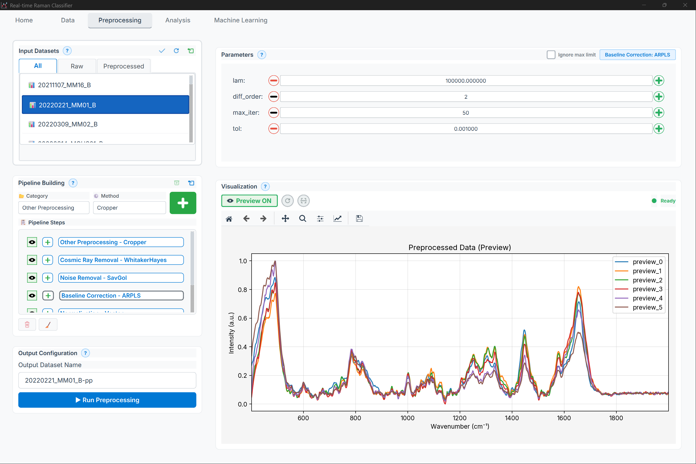
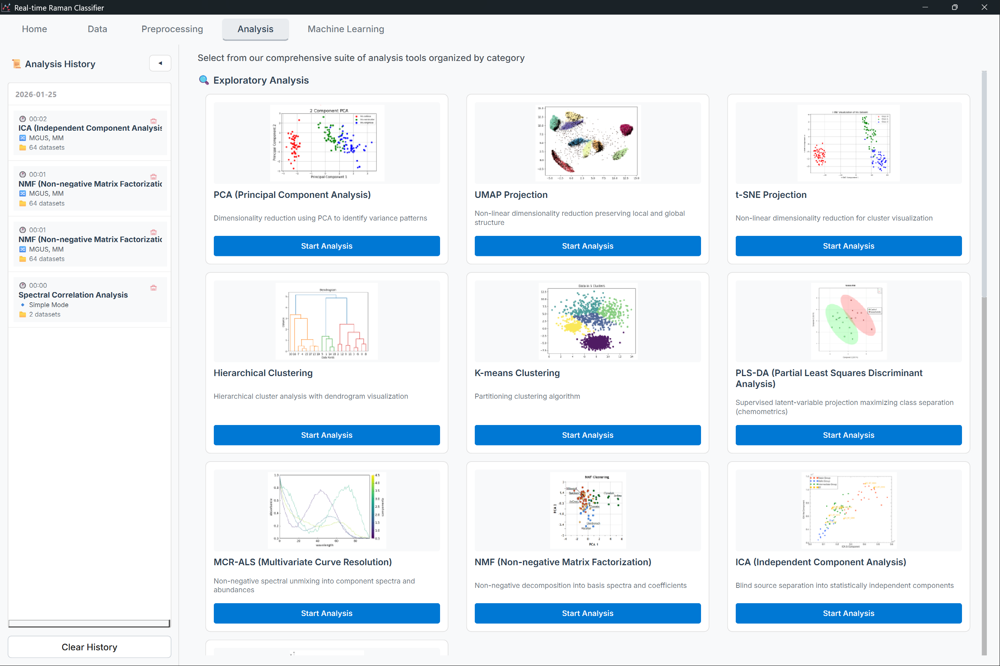
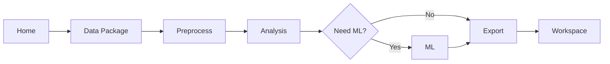

# Interface Overview

Complete guide to the Raman Spectroscopy Analysis Application user interface.

## Table of Contents
- {ref}`Main Window Layout <main-window-layout>`
- {ref}`Navigation System <navigation-system>`
- {ref}`Common UI Elements <common-ui-elements>`
- {ref}`Customization <customization>`

---

(main-window-layout)=
## Main Window Layout

The application uses a modern tabbed interface with consistent organization across all pages.

### Window Structure

*Figure: Main application window showing title bar, menu bar, tab navigation, and status bar*

### Key Components

1. **Title Bar**
   - Application name
   - Standard window controls (minimize, maximize, close)

2. **Menu Bar**
   - File operations (New, Open, Save, Export)
   - Edit functions (Undo, Redo, Copy, Paste)
   - View options (Theme, Zoom, Layout)
   - Tools (Calibration, Batch Processing)
   - Settings (Preferences, Configurations)
   - Help (Documentation, About)

3. **Language & Theme Switcher**
   - **[EN/JA]**: Toggle between English and Japanese
   - **🌙/☀️**: Toggle between dark and light themes

4. **Tab Navigation**
   - **🏠 Home**: Project overview and recent activity
   - **📦 Data Package**: Data import and management
   - **🔧 Preprocess**: Preprocessing pipeline builder
   - **📊 Analysis**: Exploratory and statistical analysis
   - **🤖 ML**: Machine learning workflows
   - **💼 Workspace**: Project and file management

5. **Main Content Area**
   - Dynamic content based on selected tab
   - Responsive layout adjusts to window size
   - Split-view support for data/results

6. **Status Bar**
   - Current operation status
   - Active project name
   - System resource usage (CPU, memory)
   - Progress indicators for long operations

---

(navigation-system)=
## Navigation System

### Tab-Based Navigation

The application uses **page-based architecture** where each major function has its own dedicated tab.

#### Home Page
**Purpose**: Project dashboard and quick actions

*Figure: Home page showing recent projects, quick actions, and system status*

- Recent projects list
- Quick start tutorials
- System status overview
- News and updates

**Common Actions**:
- Create new project
- Open existing project
- Access templates
- View documentation

#### Data Package Page
**Purpose**: Data import, organization, and management

*Figure: Data Package page with file browser, dataset list, and preview panel*

- File browser for CSV/TXT import
- Data validation and preview
- Group assignment for samples
- Metadata editor

**Common Actions**:
- Import spectral data
- Create sample groups
- Edit wavenumber calibration
- Export data packages

#### Preprocess Page
**Purpose**: Build and apply preprocessing pipelines

*Figure: Preprocessing page showing method selector, parameter panel, pipeline builder, and preview plot*

- Method selector panel (40+ methods)
- Parameter configuration
- Real-time preview
- Pipeline save/load

**Common Actions**:
- Add preprocessing steps
- Adjust parameters
- Preview effects
- Apply to dataset
- Save pipeline for reuse

#### Analysis Page
**Purpose**: Exploratory and statistical analysis

*Figure: Analysis page with method categories, dataset selector, and interactive plot viewer*

- Method category tabs (Exploratory, Statistical, Visualization)
- Interactive plot viewers
- Results export
- Batch analysis support

**Common Actions**:
- Run PCA/UMAP/t-SNE
- Perform statistical tests
- Generate visualizations
- Export figures and data

#### Machine Learning Page
**Purpose**: Train, validate, and deploy ML models

*Figure: Machine Learning page showing algorithm selector, hyperparameter tuning panel, and evaluation dashboard*

- Algorithm selection panel
- Hyperparameter tuning
- Cross-validation setup
- Model evaluation dashboard

**Common Actions**:
- Select ML algorithm
- Configure validation strategy
- Train models
- Evaluate performance
- Export trained models

#### Workspace Page
**Purpose**: Project and file management

- Project directory tree
- File operations
- Settings and preferences
- Backup management

**Common Actions**:
- Browse project files
- Manage backups
- Configure settings
- Clean temporary files

 ---

(common-ui-elements)=
## Common UI Elements

### Panels and Widgets

#### Data Selector Panel

Located on the left side of most pages for selecting input data.

**Layout**: Vertical panel with checkboxes for each dataset, plus "Select All" and "Clear" buttons at the bottom.

> **Visual Reference**: See the Data Package Page screenshot for the actual appearance of this component.

**Features**:
- Multi-selection with checkboxes
- Search/filter functionality
- Select all / Clear all buttons
- Drag-and-drop support

#### Parameter Panel

Standard interface for method configuration.

**Layout**: Vertical panel with labeled parameters (Window Size, Polynomial Order, Derivative Order, etc.), each with appropriate input widgets (dropdowns, sliders, spinboxes). Action buttons (Reset, Apply, Add to Pipeline) are placed at the bottom.

> **Visual Reference**: See the Preprocessing Page screenshot for the actual parameter panel appearance.

**Features**:
- Dropdown menus for discrete choices
- Sliders for continuous ranges
- Spin boxes for numeric input
- Tooltips on hover (hover over label)
- Real-time validation
- Reset to defaults button

#### Results Panel

Standard layout for displaying analysis results.

**Layout**: Panel with "Results" header and action buttons (Copy 📋, Export Plot 📊, Save Data 💾) in the top-right. Main area shows plots or tables. Summary statistics are displayed below the main result.

> **Visual Reference**: See the Analysis Page and ML Page screenshots for actual results panel appearances.

**Features**:
- **📋**: Copy results to clipboard
- **📊**: Export plot as image (PNG, SVG)
- **💾**: Save data table (CSV, XLSX, JSON, TXT, PKL)
- Summary statistics below main result
- Zoom, pan, and interact with plots

#### Toast Notifications

Non-intrusive notifications for user feedback.

**Appearance**: Small popup notification in the bottom-right corner of the window, showing an icon (✓, ℹ️, ⚠️, or ✗) followed by a brief message and optional details. Auto-dismisses after 3-5 seconds.

**Types**:
- **Success** (✓ green): Operation completed
- **Info** (ℹ️ blue): Informational message
- **Warning** (⚠️ yellow): Potential issue
- **Error** (✗ red): Operation failed

### Dialog Windows

#### Multi-Group Selection Dialog

Used for assigning samples to multiple groups.

**Layout**: Modal dialog with "Assign Samples to Groups" title. Checkboxes list available groups. Management buttons (+ New Group, Edit, Delete) below the list. Standard Cancel/OK buttons at the bottom.

> **Visual Reference**: See the Data Package Page screenshot showing group management dialogs.

#### External Evaluation Dialog

For uploading test sets for model evaluation.

**Layout**: Modal dialog with "External Test Set Evaluation" title. Three file selection rows: Test Data File (required), Labels File (optional), and Model File (required). Each row has a "Browse..." button and displays the selected filename. Cancel and Evaluate buttons at the bottom.

> **Visual Reference**: See the Machine Learning Page screenshot showing evaluation dialogs.

 ---

(customization)=
## Customization

### Theme Selection

**Light Theme** (Default for well-lit environments):
- White background
- Dark text
- Blue accents
- High contrast for readability

**Dark Theme** (Recommended for extended use):
- Dark gray/black background
- Light text
- Cyan/green accents
- Reduced eye strain

**How to switch**:
1. Click 🌙/☀️ icon in top-right corner
2. Or: `Settings → Appearance → Theme`
3. Changes apply immediately (no restart needed)

### Language Selection

**English (EN)** - Default interface language  
**Japanese (JA)** - Complete Japanese translation

**How to switch**:
1. Click **[EN/JA]** button in top-right corner
2. Or: `Settings → Language → Interface Language`
3. Restart application for full effect

**Note**: Plot labels and some technical terms remain in English for scientific consistency.

### Layout Customization

#### Split-View Mode

Display data and results side-by-side:

*Figure: Split-view layout (data on left, results on right)*

**Enable**: `View → Layout → Split View` or `Ctrl + Shift + 2`

#### Compact Mode

Reduce padding and margins for smaller screens:

**Enable**: `View → Layout → Compact Mode`

### Font Settings

Adjust text size for better readability:

1. Go to `Settings → Appearance → Font`
2. Options:
   - **UI Font Size**: 8pt - 16pt (default: 10pt)
   - **Code Font**: Monospace fonts for technical views
   - **Plot Font**: Font for chart labels (8pt - 14pt)

### Panel Visibility

Show/hide specific panels:

- `View → Panels → Data Selector` (toggle left panel)
- `View → Panels → Parameters` (toggle right panel)
- `View → Panels → Status Bar` (toggle bottom bar)

### Default Directories

Configure default locations:

1. `Settings → Paths`
2. Set:
   - **Projects Directory**: Default location for new projects
   - **Data Import Directory**: Default for file browser
   - **Export Directory**: Default for saved results
   - **Pipeline Library**: Location for saved pipelines

---

## Workflow Integration

### Typical User Workflow

1. **Start at Home**: Create or open project
2. **Import Data**: Use Data Package page to load spectra
3. **Preprocess**: Build preprocessing pipeline
4. **Analyze**: Run exploratory or statistical analysis
5. **ML (Optional)**: Train classification/regression models
6. **Export**: Save results and trained models
7. **Manage**: Use Workspace for file organization

### Context Preservation

The application **remembers your state**:
- Last opened project
- Recent file selections
- Tab positions
- Panel visibility
- Theme and language preferences
- Window size and position

**Data persists** between sessions automatically.

---

## Accessibility Features

### High Contrast Mode

For users with visual impairments:

**Enable**: `Settings → Accessibility → High Contrast`

**Features**:
- Increased contrast ratios (7:1 minimum)
- Thicker borders and outlines
- Larger click targets
- Distinguishable focus indicators

### Screen Reader Support

Compatible with:
- **NVDA** (Windows)
- **JAWS** (Windows)
- **VoiceOver** (macOS)

**Enable**: `Settings → Accessibility → Screen Reader Mode`

### Keyboard-Only Navigation

All features accessible via keyboard:
- Tab through interactive elements
- Arrow keys for navigation
- Enter/Space to activate
- Escape to cancel

---

## Tips and Best Practices

### Performance Optimization

**For large datasets (>1000 spectra)**:
1. Enable "Compact Mode" to reduce memory usage
2. Close unused tabs
3. Disable real-time preview during preprocessing
4. Use batch processing for multiple operations

### Multi-Monitor Setup

**Optimizing for dual displays**:
1. Drag main window to primary monitor
2. Open plot windows on secondary monitor
3. Use `View → Detach Plots` to create floating windows
4. Arrange for optimal comparison

### Quick Actions

**Speed up common tasks**:
- Right-click on datasets for context menu
- Use middle-click to open in new window
- Double-click on results to expand
- Drag-and-drop files directly into import area

---

## Troubleshooting UI Issues

### Interface Not Responding

**Symptoms**: UI freezes, buttons don't respond

**Solutions**:
1. Wait for current operation to complete (check status bar)
2. Press `Ctrl + .` to stop operation
3. If frozen >30s, check Task Manager for CPU usage
4. Force close and restart if necessary

### Missing Panels

**Symptoms**: Panels disappeared or not visible

**Solutions**:
1. Check `View → Panels` menu to re-enable
2. Reset layout: `View → Layout → Reset to Default`
3. Check window size (panels hide on small screens)

### Font Rendering Issues

**Symptoms**: Text appears blurry or incorrect

**Solutions**:
1. Update graphics drivers
2. Disable display scaling: `Settings → Appearance → Disable Scaling`
3. Change font: `Settings → Appearance → Font → System Default`

### Theme Not Applying

**Symptoms**: Theme changes don't take effect

**Solutions**:
1. Restart application
2. Reset theme: `Settings → Appearance → Reset Theme`
3. Delete config file: `C:\Users\<username>\.raman_app\ui_config.json`

---

## See Also

- [Data Import Guide](data-import.md) - Detailed data management
- [Settings and Preferences](../faq.md) - Configuration options
- [Accessibility Documentation](../faq.md) - Accessibility features

---

**Next**: [Data Import Guide](data-import.md) →
