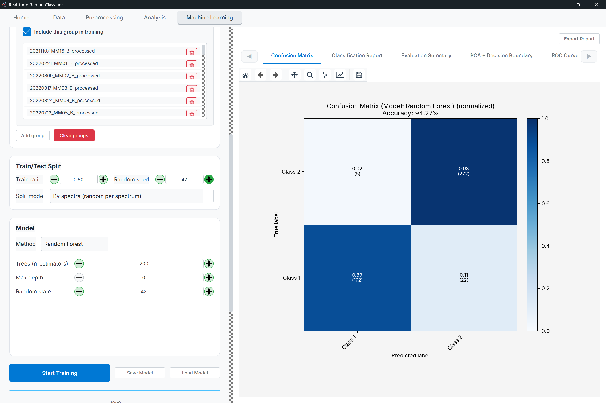
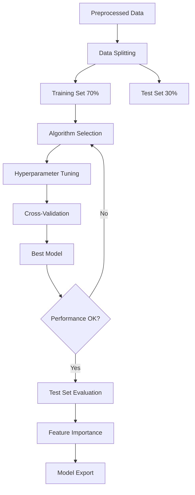

# Machine Learning Guide

Complete guide to building, training, evaluating, and deploying machine learning models for Raman spectroscopy classification and regression.

## Table of Contents
- {ref}`Overview <ml-overview>`
- {ref}`ML Workflow <ml-workflow>`
- {ref}`Algorithm Selection <algorithm-selection>`
- {ref}`Training and Validation <training-and-validation>`
- {ref}`Model Evaluation <model-evaluation>`
- {ref}`Model Interpretation <model-interpretation>`
- {ref}`Model Export and Deployment <model-export-and-deployment>`

---

(ml-overview)=
## Overview

### Machine Learning Page

The ML page provides a complete workflow for supervised learning:



*Figure: Machine Learning page showing dataset selector (left), algorithm/validation configuration (center-right), and results dashboard (bottom)*

> **Note**: The ML page layout includes:
> - **Left Panel**: Training data selection and group assignment
> - **Center-Right**: Algorithm selection, validation strategy, and hyperparameter optimization settings
> - **Bottom**: Results dashboard with performance metrics, ROC curves, confusion matrix, and feature importance

**Key Features**:
- Configure algorithms, validation, and hyperparameters in one place
- Review metrics and plots (AUC/accuracy, ROC curve, confusion matrix, feature importance)
- Export and report actions: **View Detailed Results**, **Export Model**, **Save Report**

### When to Use ML

**Use Cases**:
- ✅ **Classification**: Diagnose disease presence/absence
- ✅ **Multi-class**: Classify multiple disease types
- ✅ **Regression**: Predict continuous values (concentration, biomarker levels)
- ✅ **Feature selection**: Identify most important wavenumbers

**Requirements**:
- Labeled data (group assignments or values)
- Sufficient samples (>50 per class recommended)
- Preprocessed spectra
- Clear research question

**Not suitable for**:
- ❌ Exploratory analysis (use PCA, UMAP instead)
- ❌ Unlabeled data (use clustering)
- ❌ Very small datasets (<20 samples)
- ❌ When interpretability is sole goal (use statistical tests)

---

(ml-workflow)=
## ML Workflow

### Complete Workflow



### Step-by-Step Guide

#### Step 1: Prepare Data

**Requirements**:
- Preprocessed spectra
- Group labels assigned
- No missing values
- Balanced classes (if possible)

**Check**:
```
Data Summary:
- Healthy Control: 75 samples
- Disease Group: 68 samples
- Total: 143 samples
- Features: 1000 wavenumbers
- Class balance: 52% / 48% ✓
```

#### Step 2: Split Data

**Strategy**: Separate test set before any ML

**Recommended Split**:
```
Total: 143 samples

Training Set: 100 samples (70%)
- Used for: Model training, hyperparameter tuning, CV
- Healthy: 52 samples
- Disease: 48 samples

Test Set: 43 samples (30%)
- Used for: Final evaluation only
- Healthy: 23 samples
- Disease: 20 samples
```

**Implementation**:
1. Click **[Split Dataset]** button
2. Choose split strategy:
   - **Patient-level**: Keep all spectra from one patient together ✓ (Recommended)
   - **Spectrum-level**: Random split (risk of data leakage)
3. Set split ratio: 70/30
4. Click **[Split]**

**Result**: Two new datasets created
- `training_set.csv`
- `test_set.csv`

#### Step 3: Select Training Data

1. In ML page, select training set only
2. Verify groups are correct
3. Check for class imbalance

#### Step 4: Choose Algorithm

See [Algorithm Selection](#algorithm-selection) section for details

**Quick Recommendations**:
- **Start with**: Random Forest (robust, fast, interpretable)
- **If RF works well**: Try XGBoost (often better performance)
- **For linear separation**: Logistic Regression or SVM (linear kernel)
- **For complex patterns**: SVM (RBF kernel) or XGBoost

#### Step 5: Configure Validation

**GroupKFold (Recommended)**:
- Ensures patient-level splitting
- Prevents data leakage
- n=5 or n=10 folds

**Why important?**:
```
Wrong: Spectrum-level split
Patient 1: Spectra A, B, C → Some in train, some in test
Result: Overly optimistic performance (data leakage)

Correct: Patient-level split
Patient 1: All spectra → All in train OR all in test
Result: Realistic generalization estimate
```

#### Step 6: Set Hyperparameters

**Option A**: Use Defaults (Quick Start)
```
Good for: Initial exploration, baseline performance
```

**Option B**: Grid Search (Thorough)
```
Good for: Optimizing performance, publication
Time: Longer (5-30 minutes depending on data size)
```

**Option C**: Random Search (Efficient)
```
Good for: Large parameter spaces, time constraints
Time: Medium (2-10 minutes)
```

#### Step 7: Train Model

1. Click **[Train Model]**
2. Progress bar shows:
   - Current fold (1/5, 2/5, ...)
   - Current hyperparameter combination
   - Estimated time remaining
3. Wait for training to complete

**Training Time**:
- Random Forest: ~10-60 seconds
- SVM: ~30-120 seconds
- XGBoost: ~20-90 seconds
- XGBoost: ~1-5 minutes
- SVM (RBF kernel): ~30 seconds to 5 minutes

#### Step 8: Evaluate on Test Set

**After training**:
1. Model trained on full training set with best hyperparameters
2. Automatically evaluated on test set
3. Results shown in dashboard

**Never**:
- Use test set during hyperparameter tuning
- Use test set during feature selection
- Train on test set
- Look at test set before finalizing model

---

(algorithm-selection)=
## Algorithm Selection

### Support Vector Machine (SVM)

**Principle**: Find optimal hyperplane separating classes

**Strengths**:
- ✓ High-dimensional data (many wavenumbers)
- ✓ Small to medium datasets
- ✓ Good generalization
- ✓ Kernel trick for non-linear separation

**Weaknesses**:
- ✗ Slow on large datasets (>5000 samples)
- ✗ Sensitive to scaling (auto-scaled in app)
- ✗ Black-box (hard to interpret)

**Hyperparameters**:
```
C: Regularization parameter (0.1 - 100, default: 1.0)
  - Lower → More regularization, simpler decision boundary
  - Higher → Less regularization, more complex boundary
  
Kernel: Transformation function
  - 'linear': For linearly separable data
  - 'rbf': Most common, for non-linear data
  - 'poly': Polynomial kernel
  
gamma (for RBF): Kernel coefficient (0.001 - 1, default: 'scale')
  - Lower → Smooth decision boundary
  - Higher → Complex decision boundary
```

**When to use**:
- Binary classification
- Non-linear decision boundaries (use RBF kernel)
- Feature dimensions > sample size
- Need probabilistic outputs

### Random Forest (RF)

**Principle**: Ensemble of decision trees voting on prediction

**Strengths**:
- ✓ Fast training and prediction
- ✓ Handles non-linear relationships
- ✓ Feature importance built-in
- ✓ Robust to outliers
- ✓ No scaling required
- ✓ Good baseline performance

**Weaknesses**:
- ✗ Can overfit on noisy data
- ✗ Less accurate than gradient boosting
- ✗ Biased toward high-cardinality features

**Hyperparameters**:
```
n_estimators: Number of trees (50 - 500, default: 100)
  - More trees → Better performance, slower
  - Diminishing returns after ~200
  
max_depth: Maximum tree depth (5 - 50, default: None)
  - Limit depth to prevent overfitting
  - None = unlimited (risky)
  
min_samples_split: Min samples to split node (2 - 20, default: 2)
  - Higher → More regularization
  
max_features: Features per split ('sqrt', 'log2', default: 'sqrt')
  - 'sqrt': Good default for classification
  - 'log2': Alternative
```

**When to use**:
- **First choice** for most problems
- Baseline model
- Interpretability via feature importance
- Fast training required

### XGBoost (Extreme Gradient Boosting)

**Principle**: Sequentially build trees, each correcting previous errors

**Strengths**:
- ✓ State-of-the-art performance
- ✓ Built-in regularization
- ✓ Handles missing values
- ✓ Feature importance
- ✓ Efficient implementation

**Weaknesses**:
- ✗ More hyperparameters to tune
- ✗ Slower than Random Forest
- ✗ Can overfit if not regularized

**Hyperparameters**:
```
n_estimators: Number of boosting rounds (50 - 500, default: 100)
learning_rate: Step size (0.01 - 0.3, default: 0.1)
  - Lower → Better performance, needs more estimators
  - Higher → Faster training, risk of overfitting
  
max_depth: Tree depth (3 - 10, default: 6)
  - Deeper → More complex, higher risk of overfit
  
subsample: Row sampling (0.5 - 1.0, default: 1.0)
  - < 1.0 → Regularization via sampling
  
colsample_bytree: Column sampling (0.5 - 1.0, default: 1.0)
  - < 1.0 → Regularization, faster training
```

**When to use**:
- After Random Forest shows promise
- Need best possible performance
- Kaggle-style competitions
- Publication-worthy results

### Logistic Regression (LR)

**Principle**: Linear model with sigmoid activation

**Strengths**:
- ✓ Fast training
- ✓ Interpretable coefficients
- ✓ Probabilistic outputs
- ✓ Works well for linearly separable data
- ✓ No hyperparameter tuning needed

**Weaknesses**:
- ✗ Limited to linear decision boundaries
- ✗ May underfit complex data

**Hyperparameters**:
```
C: Inverse regularization (0.01 - 100, default: 1.0)
  - Lower → More regularization
  - Higher → Less regularization
  
penalty: Regularization type ('l1', 'l2', default: 'l2')
  - 'l2': Ridge (most common)
  - 'l1': Lasso (sparse solutions, feature selection)
```

**When to use**:
- Baseline model
- Need interpretable coefficients
- Linearly separable classes
- Fast training required
- Probabilistic predictions needed

### Algorithm Comparison

| Algorithm               | Speed | Accuracy | Interpretability | Hyperparameters | Recommended For                  |
| ----------------------- | ----- | -------- | ---------------- | --------------- | -------------------------------- |
| **Logistic Regression** | ⚡⚡⚡   | ⭐⭐       | ⭐⭐⭐              | ⚙️               | Baseline, linear problems        |
| **Random Forest**       | ⚡⚡    | ⭐⭐⭐      | ⭐⭐               | ⚙️⚙️              | **First choice**, most cases     |
| **XGBoost**             | ⚡     | ⭐⭐⭐⭐     | ⭐⭐               | ⚙️⚙️⚙️             | Best performance                 |
| **SVM**                 | ⚡     | ⭐⭐⭐      | ⭐                | ⚙️⚙️              | High-dimensional, kernel methods |

**Note**: Neural networks (MLP) are planned for future releases.

---

(training-and-validation)=
## Training and Validation

### Validation Strategies

#### GroupKFold (Recommended)

**Purpose**: Patient-level cross-validation

**How it works**:
```
Fold 1: Patients 1-4 (train) | Patients 5 (test)
Fold 2: Patients 1-3, 5 (train) | Patient 4 (test)
Fold 3: Patients 1-2, 4-5 (train) | Patient 3 (test)
...
```

**Advantages**:
- ✓ Prevents data leakage
- ✓ Realistic generalization estimate
- ✓ Tests on unseen patients
- ✓ Required for patient-level spectra

**When to use**: **Always** when you have patient-level data

#### Stratified K-Fold

**Purpose**: Maintain class proportions in each fold

**How it works**:
```
Fold 1: 80% train (balanced) | 20% test (balanced)
Fold 2: Different 80%/20% split, still balanced
...
```

**When to use**:
- No patient-level structure
- Independent samples
- Class imbalance present

#### Leave-One-Patient-Out (LOPOCV)

**Purpose**: Maximum cross-validation rigor

**How it works**:
```
Iteration 1: Train on patients 2-N | Test on patient 1
Iteration 2: Train on patients 1, 3-N | Test on patient 2
...
```

**Advantages**:
- ✓ Most rigorous
- ✓ Uses all data
- ✓ Patient-level validation

**Disadvantages**:
- ✗ Computationally expensive
- ✗ High variance in estimates

**When to use**: Small datasets (<50 patients), need maximum rigor

#### Hold-out Test Set

**Purpose**: Single train/test split

**Advantages**:
- ✓ Fast
- ✓ Simple
- ✓ Easy to understand

**Disadvantages**:
- ✗ Single estimate (no confidence interval)
- ✗ Result depends on split
- ✗ Uses less training data

**When to use**: Initial exploration, very large datasets

### Hyperparameter Optimization

#### Grid Search

**Method**: Try all combinations

**Example**:
```python
# Random Forest Grid Search
n_estimators = [50, 100, 200]
max_depth = [10, 20, None]
min_samples_split = [2, 5, 10]

# Total combinations: 3 × 3 × 3 = 27
# With 5-fold CV: 27 × 5 = 135 model fits
```

**Advantages**:
- ✓ Exhaustive search
- ✓ Finds optimal combination
- ✓ Reproducible

**Disadvantages**:
- ✗ Slow for large grids
- ✗ Wastes time on bad regions

**When to use**: Small parameter spaces, need best performance

#### Random Search

**Method**: Sample random combinations

**Example**:
```python
# Sample 20 random combinations
# Faster than grid search
# Often finds good solutions
```

**Advantages**:
- ✓ Faster than grid search
- ✓ Can cover large spaces
- ✓ Often finds good solutions quickly

**When to use**: Large parameter spaces, time constraints

#### Bayesian Optimization

**Method**: Intelligently sample based on previous results

**Advantages**:
- ✓ Most efficient
- ✓ Fewer iterations needed
- ✓ Focuses on promising regions

**Disadvantages**:
- ✗ More complex
- ✗ May get stuck in local optima

**When to use**: Expensive model training, limited time

### Preventing Overfitting

**Strategies**:
1. **More data**: Collect more samples
2. **Regularization**: Increase regularization parameters
3. **Simpler model**: Reduce complexity
4. **Feature selection**: Use fewer wavenumbers
5. **Cross-validation**: Ensure good validation strategy
6. **Early stopping**: For neural networks

**Warning Signs**:
```
Training Accuracy: 99.5%
Test Accuracy: 72.3%
→ Severe overfitting!

Training Accuracy: 92.1%
Test Accuracy: 91.3%
→ Good generalization ✓
```

---

(model-evaluation)=
## Model Evaluation

### Classification Metrics

#### Accuracy

**Formula**: (TP + TN) / (TP + TN + FP + FN)

**When sufficient**: Balanced classes

**Limitations**: Misleading for imbalanced data

**Example**:
```
Dataset: 95% Healthy, 5% Disease
Model: Predicts all as Healthy
Accuracy: 95% (but useless!)
```

#### Precision, Recall, F1-Score

**Precision**: Of predicted positives, how many are correct?
```
Precision = TP / (TP + FP)
Use: When false positives are costly
```

**Recall (Sensitivity)**: Of actual positives, how many did we find?
```
Recall = TP / (TP + FN)
Use: When false negatives are costly
```

**F1-Score**: Harmonic mean of precision and recall
```
F1 = 2 × (Precision × Recall) / (Precision + Recall)
Use: Balance precision and recall
```

#### ROC Curve and AUC

**ROC (Receiver Operating Characteristic)**:
- Plot: True Positive Rate vs False Positive Rate
- Shows trade-off at different thresholds

**AUC (Area Under Curve)**:
```
AUC = 1.0: Perfect classifier
AUC = 0.9-1.0: Excellent
AUC = 0.8-0.9: Good
AUC = 0.7-0.8: Fair
AUC = 0.5: Random guessing
```

**Example**:
```
        TPR
         ↑
      1.0│     ╭─────
         │   ╭─┘
      0.8│  ╭┘
         │ ╭┘
      0.5│╭┘ AUC = 0.92
         └──────────→ FPR
         0   0.5   1.0
```

#### Confusion Matrix

**Structure**:
```
                Predicted
              Healthy  Disease
   Actual  Healthy   42       3     (Accuracy: 93%)
           Disease    2      18     (Recall: 90%)
           
   Precision:    95%     86%
```

**Interpretation**:
- **Diagonal**: Correct predictions
- **Off-diagonal**: Errors
- **False Positives (FP)**: Healthy predicted as Disease (3)
- **False Negatives (FN)**: Disease predicted as Healthy (2)

### Multi-Class Metrics

**Macro-Average**: Average metrics across classes (equal weight)
**Micro-Average**: Aggregate TP, FP, FN then calculate (weighted by class size)
**Weighted-Average**: Weight by class size

**Example**:
```
3-Class Problem:
Class A: Precision=0.95, Recall=0.92 (100 samples)
Class B: Precision=0.88, Recall=0.85 (50 samples)
Class C: Precision=0.91, Recall=0.89 (30 samples)

Macro Precision = (0.95 + 0.88 + 0.91) / 3 = 0.913
Weighted Precision = (0.95×100 + 0.88×50 + 0.91×30) / 180 = 0.919
```

### Regression Metrics

#### MAE (Mean Absolute Error)
```
MAE = mean(|predicted - actual|)
Units: Same as target variable
Interpretation: Average prediction error
```

#### RMSE (Root Mean Squared Error)
```
RMSE = sqrt(mean((predicted - actual)²))
Units: Same as target variable
Interpretation: Penalizes large errors more
```

#### R² (Coefficient of Determination)
```
R² = 1 - (SS_residual / SS_total)
Range: -∞ to 1
R² = 1: Perfect predictions
R² = 0: No better than mean
R² < 0: Worse than mean
```

---

(model-interpretation)=
## Model Interpretation

### Feature Importance

**Purpose**: Identify most important wavenumbers

#### Random Forest Feature Importance

**Method**: Mean decrease in impurity

**Interpretation**:
```
Importance vs Wavenumber

Importance
    ↑
    │     █
    │     █       █
    │ █   █   █   █     █
    │ █ █ █ █ █ █ █ █ █ █
    └──────────────────────→
      400  800  1200  1600
      
Key peaks: 1655, 1450, 1200 cm⁻¹
```

**Use**: Identify biomarker regions

#### SHAP Values (SHapley Additive exPlanations)

**Purpose**: Explain an individual prediction by attributing the model output to Raman-shift features.

**How SHAP works in this app**:

1. Train a model on the ML page.
2. Click **SHAP** (no retraining).
3. In the SHAP parameter dialog, choose:
   - Explain set (Train/Test)
   - Dataset and spectrum index
   - Background samples / Max evals / Top-k (when available)
4. A **modal SHAP Result dialog** opens and shows progress.

**What you will see** (tabs):
- **Spectrum**: the selected spectrum (with contributor markers when available)
- **SHAP**: a per-feature contribution bar plot across the Raman shift axis
  - **Red** = positive contribution (pushes prediction toward the predicted class)
  - **Blue** = negative contribution (pushes prediction away)
- **Summary / Report**: predicted class name + probability and a ranked contributor table
- **Provenance**: dataset/sample provenance (best-effort)

**Export**:
Use **Export** to write a SHAP bundle (plots + contributors CSV + raw JSON).

**Performance notes**:
- SHAP can be slow on large feature vectors; **Background samples** and **Max evals** have the biggest impact.
- Use **Stop** to cancel a long run (cancellation is best-effort/cooperative).

#### Permutation Importance

**Method**: Shuffle feature, measure performance drop

**Advantages**:
- ✓ Model-agnostic
- ✓ Reflects real predictive power
- ✓ Accounts for interactions

**Use**: Alternative to feature importance

### Model Transparency

**For Clinicians and Reviewers**:

1. **Report**: 
   - Training procedure
   - Validation strategy (GroupKFold with patient-level splitting)
   - Hyperparameters used
   - Performance metrics with confidence intervals

2. **Visualize**:
   - ROC curves
   - Confusion matrices
   - Feature importance plots
   - Example predictions with explanations

3. **Validate**:
   - Independent test set
   - External validation (different hospital, cohort)
   - Temporal validation (future patients)

---

(model-export-and-deployment)=
## Model Export and Deployment

### Saving Trained Models

**Formats**:

**1. Pickle (PKL)** - Python native
```python
# Saves entire scikit-learn model
File: trained_model.pkl
Size: 5-50 MB (depends on model)
Use: Python deployment
```

**2. ONNX (Open Neural Network Exchange)**
```python
# Cross-platform format
File: trained_model.onnx
Supports: Python, C++, Java, C#
Use: Production deployment, embedded systems
```

**3. JSON (Metadata Only)**
```python
# Model architecture and parameters
File: model_config.json
Use: Documentation, reproduction
```

**Export Steps**:
1. Train and validate model
2. Click **[Export Model]**
3. Select format (PKL or ONNX)
4. Choose location
5. Save

### Loading Models for Prediction

**In Application**:
1. Go to ML page
2. Click **[Load Model]**
3. Select model file (.pkl or .onnx)
4. Click **[Predict]**
5. Select new data
6. View predictions

**External Use** (Python):
```python
import pickle
import numpy as np

# Load model
with open('trained_model.pkl', 'rb') as f:
    model = pickle.load(f)

# Load new data
new_spectra = np.loadtxt('new_data.csv', delimiter=',')

# Preprocess (use SAME pipeline as training!)
# ... apply baseline correction, smoothing, normalization ...

# Predict
predictions = model.predict(new_spectra)
probabilities = model.predict_proba(new_spectra)

print(f"Predicted class: {predictions[0]}")
print(f"Probability: {probabilities[0]}")
```

### Model Deployment Checklist

**Before Deployment**:
- [ ] Model validated on independent test set
- [ ] Preprocessing pipeline saved and documented
- [ ] Performance metrics meet requirements
- [ ] Feature importance analyzed and validated
- [ ] Model interpretability verified
- [ ] Documentation completed
- [ ] Code reviewed
- [ ] Ethical approval obtained (if clinical use)

**Deployment Considerations**:
1. **Data Quality**: Ensure new data matches training data quality
2. **Preprocessing**: Apply EXACT same pipeline
3. **Model Updates**: Plan for retraining with new data
4. **Monitoring**: Track prediction confidence and errors
5. **Human Oversight**: Always include expert review for critical decisions

---

## Troubleshooting

### Poor Performance (Accuracy <70%)

**Causes**:
- Insufficient preprocessing
- Classes not actually separable
- Too few samples
- Inappropriate algorithm

**Solutions**:
- Improve preprocessing (try different methods)
- Increase sample size
- Try different algorithms
- Check if problem is solvable (run PCA first)
- Verify labels are correct

### Overfitting (Train >> Test)

**Symptoms**:
```
Training Accuracy: 98%
Test Accuracy: 68%
Difference: 30% → Overfitting!
```

**Solutions**:
- Reduce model complexity (lower max_depth, fewer estimators)
- Increase regularization (lower C, higher alpha)
- Use more training data
- Feature selection (reduce number of wavenumbers)
- Stronger cross-validation

### Class Imbalance

**Problem**:
```
Healthy: 300 samples
Disease: 30 samples (10:1 ratio)
Model predicts all as Healthy → 90% accuracy but useless
```

**Solutions**:
1. **Collect more data** (best solution)
2. **Use `class_weight='balanced'`** in model
3. **SMOTE** (Synthetic Minority Over-sampling)
4. **Undersampling** majority class
5. **Adjust decision threshold**
6. **Focus on F1-score** instead of accuracy

### Data Leakage

**Problem**: Information from test set leaks into training

**Common Causes**:
- Normalizing before splitting
- Feature selection on full dataset
- Using test set during hyperparameter tuning
- Spectrum-level split with patient-level replicates

**Prevention**:
1. Split data FIRST (patient-level)
2. Fit preprocessing ONLY on training set
3. NEVER look at test set during model development
4. Use GroupKFold for patient-level data

---

## See Also

- [Analysis Guide](analysis.md) - Previous step: Exploratory analysis
- [Machine Learning Methods Reference](../analysis-methods/machine-learning.md) - Detailed algorithm documentation
- [Best Practices](best-practices.md) - ML best practices
- {ref}`FAQ - Machine Learning <faq-machine-learning>` - Common questions

---

**Next**: [Best Practices](best-practices.md) →
