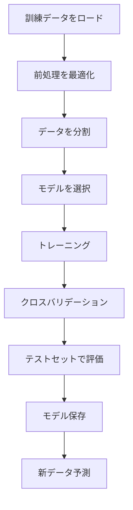

# ユーザーガイド

ラマン分光分析アプリケーションの完全な使用マニュアル

---

## 📖 このガイドについて

このユーザーガイドは、アプリケーションのすべての機能と機能性の包括的なドキュメントです。初心者から上級者まで、すべてのユーザーがアプリケーションを最大限に活用できるように設計されています。

---

## 🎯 対象読者

### 初心者

アプリケーションを初めて使用する場合：

1. **[クイックスタート](../quick-start.md)** - 5分でアプリを使い始める
2. **[データのインポート](data-import.md)** - データのロードと管理
3. **[前処理](preprocessing.md)** - スペクトルの準備
4. **[分析](analysis.md)** - 最初の分析を実行

### 中級ユーザー

基本を理解している場合：

1. **高度な前処理** - 複雑なパイプライン（準備中）
2. **統計分析** - グループ比較（準備中）
3. **[機械学習](machine-learning.md)** - 予測モデル
4. **ワークフロー最適化** - 効率的な分析（準備中）

### 上級ユーザー

すべての機能を活用したい場合：

1. **カスタムパイプライン** - 独自のワークフロー（準備中）
2. **バッチ処理** - 大規模データセット（準備中）
3. **プログラマティックアクセス** - Pythonスクリプト（準備中）
4. **カスタム手法** - 独自のアルゴリズム（準備中）

---

## 📚 ガイドセクション

### 1. データ管理

**[データのインポート](data-import.md)**
- CSVファイルの読み込み
- データ形式と要件
- バッチインポート
- データ検証

**グループ管理**（準備中）
- グループの作成と編集
- サンプルの割り当て
- グループの色分け
- グループ情報のエクスポート


※英語版と構成を揃えるため、「プロジェクト管理」や「結果のエクスポート」の個別ページは統合しました。
必要な情報は、上記の「データのインポート」や各ガイド内の該当セクションを参照してください。

### 2. スペクトル処理

**[前処理](preprocessing.md)**
- ベースライン補正
- スムージングとノイズ除去
- 正規化手法
- パイプラインの構築と管理

**品質管理**（準備中）
- スペクトル品質の評価
- 外れ値の検出
- データクリーニング
- 品質レポート

**スペクトル操作**（準備中）
- トリミングとリサンプリング
- 数学的演算
- スペクトルの結合
- リファレンス減算

### 3. データ分析

**[分析](analysis.md)**
- PCA（主成分分析）
- UMAP と t-SNE
- クラスタリング
- 統計検定

**可視化**（準備中）
- スペクトルプロット
- スコアプロットとローディング
- ヒートマップ
- 3D可視化

**結果の解釈**（準備中）
- スコアとローディングの理解
- クラスターの解釈
- 統計的有意性
- 結果のレポート作成

### 4. 機械学習

**[機械学習](machine-learning.md)**
- アルゴリズムの選択
- モデルのトレーニング
- クロスバリデーション
- ハイパーパラメータ調整

**モデル評価**（準備中）
- パフォーマンスメトリクス
- 混同行列
- ROC曲線
- 学習曲線

**予測と分類**（準備中）
- 新しいサンプルの予測
- 確率の解釈
- 信頼区間
- モデルの保存と読み込み

### 5. エクスポートと共有

**結果のエクスポート**（準備中）
- Excelへのエクスポート
- 図の保存（PNG, PDF, SVG）
- レポート生成
- バッチエクスポート

**データ共有**（準備中）
- プロジェクトのエクスポート
- テンプレートの保存
- 設定の共有
- 協同作業

---

## 🚀 アプリケーションインターフェース

### メイン画面

アプリケーションは複数のタブで構成されています：

UI の全体レイアウトは **スクリーンショット**で確認してください：

- **{ref}`インターフェース概要: メインウィンドウ <ui-main-window>`**

### 1. ホームタブ

**機能**:
- アプリケーションの概要
- 最近のプロジェクト
- クイックアクション
- システム情報

**クイックアクション**:
- 新しいプロジェクト
- プロジェクトを開く
- サンプルデータをロード
- ドキュメントを開く

### 2. データパッケージタブ

**機能**:
- データのインポート
- スペクトルの表示
- グループ管理
- データ情報

**主要コンポーネント**:

主要コンポーネント（実画面）はスクリーンショットを参照してください：

- **{ref}`インターフェース概要: データパッケージタブ <ui-data-package-tab>`**

### 3. 前処理タブ

**機能**:
- 前処理ステップの追加
- パラメータの設定
- プレビュー
- パイプラインの管理

**ワークフロー**:
```
選択したスペクトル
    ↓
[ステップ1: AsLS]      [パラメータ] [プレビュー]
    ↓
[ステップ2: スムージング] [パラメータ] [プレビュー]
    ↓
[ステップ3: 正規化]     [パラメータ] [プレビュー]
    ↓
[適用] [保存] [リセット]
```

### 4. 分析タブ

**機能**:
- 分析手法の選択
- パラメータの設定
- 結果の表示
- エクスポート

**レイアウト**:

レイアウト（実画面）はスクリーンショットを参照してください：

- **{ref}`インターフェース概要: 分析タブ <ui-analysis-tab>`**

### 5. 機械学習タブ

**機能**:
- アルゴリズムの選択
- トレーニング設定
- モデルの評価
- 予測

**ワークフロー**:
```
データ準備
    ↓
アルゴリズム選択 → [SVM] [Random Forest] [XGBoost]
    ↓
トレーニング設定 → [CV] [テスト分割] [パラメータ]
    ↓
トレーニング実行 → [進行状況バー]
    ↓
結果評価 → [混同行列] [メトリクス] [曲線]
    ↓
[モデル保存] [予測] [エクスポート]
```

---

## 🔧 一般的なワークフロー

### ワークフロー1: 基本的な探索的分析


**詳細手順**:

1. **データのインポート**（2分）
   ```
   データパッケージ → ファイルをインポート → CSV選択 → ロード
   ```

2. **グループの作成**（1分）
   ```
   グループ管理 → 新規グループ → 名前入力 → サンプル割り当て
   ```

3. **前処理**（3分）
   ```
   前処理 → ステップ追加 → AsLS → パラメータ設定 → 適用
   ```

4. **PCA実行**（1分）
   ```
   分析 → PCA選択 → 成分数設定 → 実行
   ```

5. **結果確認**（2分）
   ```
   スコアプロット確認 → ローディング確認 → 説明分散確認
   ```

6. **エクスポート**（1分）
   ```
   エクスポート → フォーマット選択 → 保存
   ```

**所要時間**: 10分  
**難易度**: 初級

### ワークフロー2: グループ比較


**詳細手順**:

1. **データ準備**（5分）
   - 複数のグループ（少なくとも2つ）
   - 各グループ少なくとも3サンプル
   - 適切なラベル付け

2. **前処理**（5分）
   ```
   推奨パイプライン:
   - AsLS (lambda=100000)
   - Savitzky-Golay (window=11, polyorder=3)
   - SNV
   ```

3. **統計検定**（3分）
   - 2グループ: t検定
   - 3+グループ: ANOVA
   - 有意水準: 0.05

4. **結果解釈**（5分）
   - p値を確認
   - 効果量を評価
   - 有意な波数を特定

5. **レポート作成**（2分）
   - 統計表をエクスポート
   - 図を保存
   - 解釈を文書化

**所要時間**: 20分  
**難易度**: 中級

### ワークフロー3: 機械学習分類



**詳細手順**:

1. **訓練データをロード**（5分）
   - 目的変数（クラス/ラベル）が付与されたデータを準備
   - 欠損やラベル不整合がないか確認

2. **前処理最適化**（15分）
   ```
   複数のパイプラインを試す:
   - パイプライン1: AsLS + ベクトルノルム
   - パイプライン2: AirPLS + SNV
   - パイプライン3: AsLS + 微分 + 正規化
   最適なパイプラインを選択
   ```

3. **モデル選択**（10分）
   ```
   アルゴリズムを比較:
   - SVM
   - Random Forest
   - XGBoost
   - ロジスティック回帰
   ```

4. **トレーニングと評価**（15分）
   ```
   各モデルについて:
   - 5-fold クロスバリデーション
   - ハイパーパラメータ調整
   - テストセットで評価
   ```

5. **最適モデルの選択**（5分）
   - 精度を比較
   - 混同行列を確認
   - ROC-AUCを評価

6. **デプロイメント**（5分）
   - モデルを保存
   - 予測関数を作成
   - ドキュメント作成

**所要時間**: 60分  
**難易度**: 上級

---

## 💡 ベストプラクティス

### データ管理

#### ✅ 推奨事項

1. **一貫したファイル命名**
   ```
   良い例:
   - sample_001_group_A.csv
   - sample_002_group_A.csv
   - sample_003_group_B.csv
   
   悪い例:
   - data.csv
   - test.csv
   - final_final_v2.csv
   ```

2. **メタデータの保持**
   - 測定日
   - 測定条件
   - サンプル情報
   - 前処理履歴

3. **バックアップ戦略**
   ```
   定期的なバックアップ:
   - 日次: プロジェクトファイル
   - 週次: 完全なバックアップ
   - 月次: アーカイブ
   ```

4. **バージョン管理**
   - プロジェクトバージョン番号
   - 変更履歴
   - 分析ログ

#### ❌ 避けるべき事項

- 元データの上書き
- 不明確なファイル名
- バックアップなしの分析
- メタデータの欠落

### 前処理

#### ✅ 推奨事項

1. **段階的アプローチ**
   ```
   1. 基本的な前処理から開始
   2. プレビューで効果を確認
   3. 必要に応じて追加のステップ
   4. パラメータを最適化
   ```

2. **パイプラインテンプレート**
   ```
   用途別テンプレート:
   - 生物医学: AsLS + SNV + 微分
   - 材料科学: AirPLS + ベクトルノルム
   - 品質管理: AsLS + Savitzky-Golay + MSC
   ```

3. **パラメータ文書化**
   - すべてのステップを記録
   - パラメータ値を保存
   - 理由を文書化

4. **検証**
   ```
   各ステップ後に確認:
   - ベースラインが平坦か
   - ピークが保持されているか
   - ノイズが減少しているか
   - スケールが適切か
   ```

#### ❌ 避けるべき事項

- プレビューなしの適用
- 過度な処理
- パラメータの無記録
- 検証の欠如

### 分析

#### ✅ 推奨事項

1. **探索的分析から開始**
   ```
   1. PCAで全体像を把握
   2. 外れ値を特定
   3. グループ分離を確認
   4. 詳細分析を計画
   ```

2. **複数の手法を使用**
   ```
   相補的な分析:
   - PCA + クラスタリング
   - UMAP + 統計検定
   - PCA + 機械学習
   ```

3. **結果の検証**
   - 視覚的検証
   - 統計的検証
   - 生物学的/化学的妥当性

4. **再現性の確保**
   ```
   すべてを記録:
   - 使用した手法
   - パラメータ設定
   - 結果の解釈
   - 結論
   ```

#### ❌ 避けるべき事項

- 単一の分析手法に依存
- 視覚的検証の欠如
- 結果の過度な解釈
- 再現性の無視

### 機械学習

#### ✅ 推奨事項

1. **適切なデータ分割**
   ```
   推奨分割:
   - 訓練: 70%
   - 検証: 15%（ハイパーパラメータ調整用）
   - テスト: 15%（最終評価用）
   ```

2. **クロスバリデーション**
   ```
   必須の使用:
   - 5-fold または 10-fold CV
   - 層化サンプリング
   - 複数回実行して平均化
   ```

3. **複数のメトリクス**
   ```
   総合評価:
   - 精度
   - 精密度、再現率、F1スコア
   - ROC-AUC
   - 混同行列
   ```

4. **過学習の監視**
   ```
   チェック項目:
   - 訓練 vs テスト精度の差
   - 学習曲線
   - 正則化の使用
   ```

#### ❌ 避けるべき事項

- データ分割なし
- クロスバリデーションの欠如
- 単一メトリクスに依存
- 過学習の無視

---

## 🎯 ユースケース別ガイド

### ユースケース1: 研究開発

**目的**: 新しい化合物の特性評価

**推奨ワークフロー**:
1. データ収集とグループ化
2. 包括的な前処理
3. 探索的分析（PCA, UMAP）
4. 統計的比較
5. 詳細なレポート作成

**重点事項**:
- 再現性
- 統計的厳密性
- 出版品質の図
- 詳細な文書化

### ユースケース2: 品質管理

**目的**: 製品の一貫性確認

**推奨ワークフロー**:
1. 標準スペクトルの確立
2. 自動前処理パイプライン
3. 類似度計算
4. 合格/不合格判定
5. トレンド監視

**重点事項**:
- 速度と効率
- 自動化
- 明確な基準
- トレーサビリティ

### ユースケース3: 医療診断

**目的**: バイオマーカーの検出と分類

**推奨ワークフロー**:
1. 臨床サンプルの収集
2. 標準化された前処理
3. 機械学習分類
4. 性能検証
5. 診断レポート

**重点事項**:
- 高精度
- 感度と特異度
- 臨床的妥当性
- 規制準拠

### ユースケース4: 教育

**目的**: ラマン分光法の教育

**推奨ワークフロー**:
1. サンプルデータの使用
2. 段階的なチュートリアル
3. インタラクティブな実演
4. 学生プロジェクト
5. 評価とフィードバック

**重点事項**:
- わかりやすさ
- インタラクティブ性
- 視覚的教材
- 段階的な学習

---

## 🔍 高度なトピック

### カスタムパイプライン

**目的**: 特定のニーズに合わせたワークフロー

**構築方法**:
1. 要件を定義
2. 個別のステップをテスト
3. 順序を最適化
4. パラメータを調整
5. テンプレートとして保存

**例**: 蛍光除去特化パイプライン
```
1. AirPLS (高lambda値)
2. Whittaker スムージング
3. 一次微分
4. SNV 正規化
```

### バッチ処理

**目的**: 大量のサンプルを効率的に処理

**設定方法**:
1. バッチ設定ファイルの作成
2. 前処理パイプラインの定義
3. 自動実行のスケジュール
4. 結果の自動エクスポート

**利点**:
- 時間節約
- 一貫性
- エラー削減
- スケーラビリティ

### プログラマティックアクセス

**目的**: Pythonスクリプトによる自動化

**基本例**:
```python
from raman_app import RamanAnalyzer

# アナライザーを初期化
analyzer = RamanAnalyzer()

# データをロード
analyzer.load_data("spectra.csv")

# 前処理パイプライン
analyzer.add_preprocessing("AsLS", lambda=100000)
analyzer.add_preprocessing("Vector Norm")
analyzer.apply_preprocessing()

# PCAを実行
results = analyzer.run_pca(n_components=2)

# 結果をエクスポート
analyzer.export_results("output.xlsx")
```

---

## 📊 データ形式

### 入力形式

**CSVフォーマット**（推奨）:
```text
Wavenumber,Sample1,Sample2,Sample3
400.0,0.123,0.145,0.112
401.0,0.134,0.156,0.123
402.0,0.145,0.167,0.134
...
```

**要件**:
- ヘッダー行必須
- 第1列: 波数
- 以降の列: サンプル強度
- 数値データのみ

**TXTフォーマット**:
```
# コメント行
400.0  0.123  0.145  0.112
401.0  0.134  0.156  0.123
402.0  0.145  0.167  0.134
...
```

**Excelフォーマット**:
- .xlsx または .xls
- 最初のシートを使用
- CSV と同じ構造

### 出力形式

**Excel (.xlsx)**:
- 複数のシート
- 生データと処理済みデータ
- 分析結果
- メタデータ

**CSV (.csv)**:
- 単一のデータテーブル
- 分析結果
- 互換性が高い

**画像 (PNG, PDF, SVG)**:
- 高解像度の図
- 出版品質
- ベクトルまたはラスター

**レポート (PDF)**:
- 完全な分析レポート
- 図と表
- 統計結果
- メタデータ

---

## 🆘 ヘルプとサポート

### ドキュメントリソース

- **[クイックスタート](../quick-start.md)** - 迅速な開始
- **[はじめに](../getting-started.md)** - セットアップと基本の流れ
- **[分析手法](../analysis-methods/index.md)** - 手法の詳細
- **[FAQ](../faq.md)** - よくある質問
- **[トラブルシューティング](../troubleshooting.md)** - 問題解決

### コミュニティサポート

- **[GitHub Discussions](https://github.com/your-org/raman-app/discussions)** - 質問と議論
- **[GitHub Issues](https://github.com/your-org/raman-app/issues)** - バグ報告と機能リクエスト
- **Email**: support@example.com

### フィードバック

アプリケーションの改善にご協力ください：

- **機能リクエスト**: [GitHub Issues](https://github.com/your-org/raman-app/issues)で提案
- **バグ報告**: 詳細な情報を含めて報告
- **ドキュメント改善**: プルリクエストを歓迎

---

## 🔄 次のステップ

ユーザーガイドを読んだ後：

1. **実践**: 自分のデータで試す
2. **探索**: 高度な機能を学ぶ
3. **最適化**: ワークフローを改善
4. **共有**: コミュニティに貢献

---

**最終更新**: 2026年1月24日 | **バージョン**: 1.0.0
