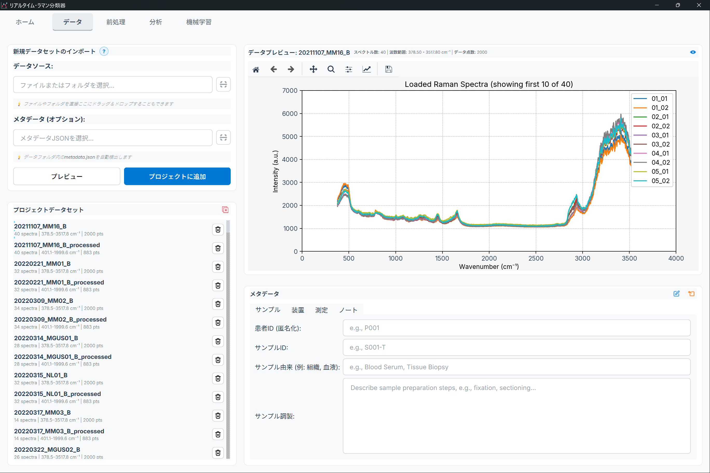
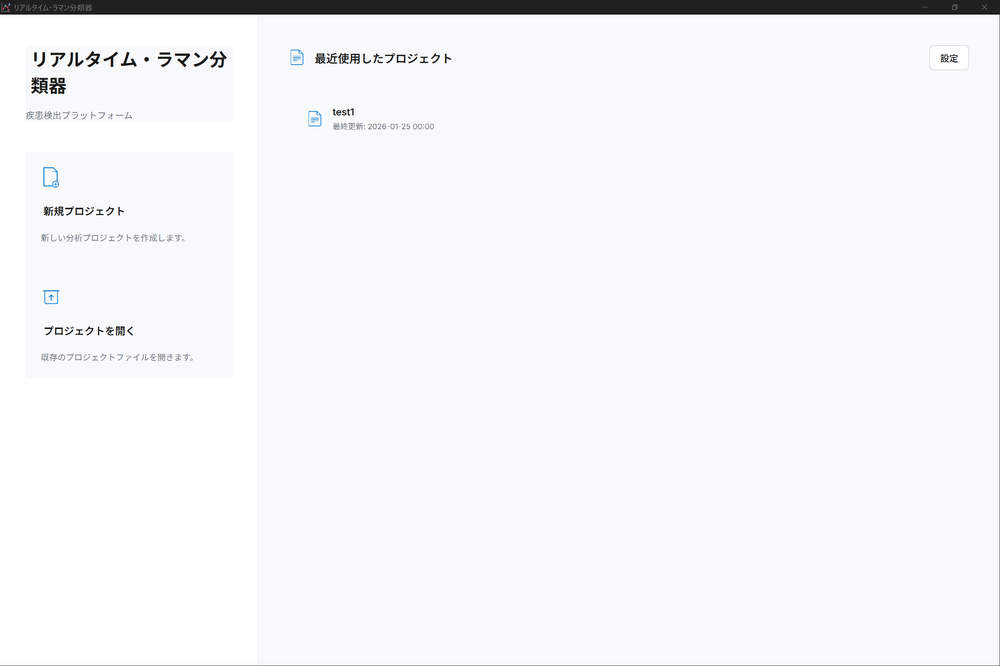
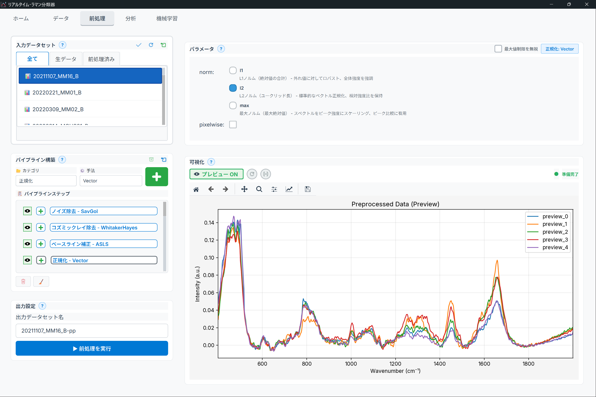
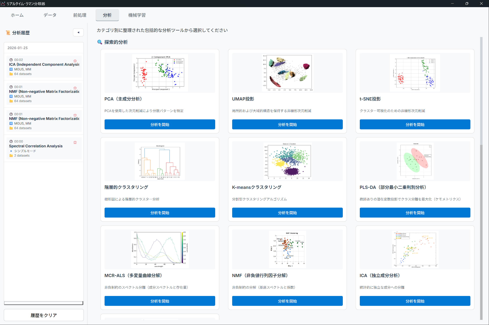
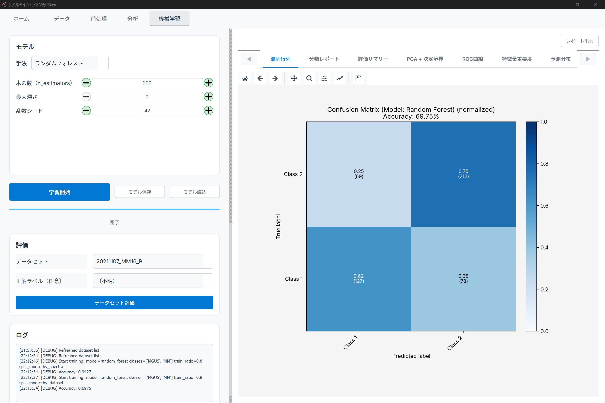

# インターフェース概要

ラマン分光分析アプリケーションのユーザーインターフェース（UI）構成をまとめます。

> **方針**: UI のレイアウト説明は ASCII 図ではなく **実際のスクリーンショット**を使用します。
> スクリーンショットは `docs/assets/screenshots/ja/` に配置してください。

## 目次

- {ref}`メインウィンドウ <ui-main-window>`
- {ref}`ホームタブ <ui-home-tab>`
- {ref}`データパッケージタブ <ui-data-package-tab>`
- {ref}`前処理タブ <ui-preprocessing-tab>`
- {ref}`分析タブ <ui-analysis-tab>`
- {ref}`機械学習タブ <ui-ml-tab>`

---

(ui-main-window)=
## メインウィンドウ

*図: タイトルバー、タブナビゲーション、メインコンテンツ、ステータスバーを含むメイン画面*

> **Note**: スクリーンショットを `docs/assets/screenshots/ja/data-package-page.png` に追加してください。

### 構成要素（概要）

- **タブナビゲーション**: ホーム / データ / 前処理 / 分析 / 機械学習 などの主要機能へ移動します。
- **メインコンテンツ領域**: 選択中のタブに応じて、設定パネル・結果表示・グラフ等が表示されます。
- **ステータスバー**: 準備状態、処理中の進捗、データ件数などが表示されます。

---

(ui-home-tab)=
## ホームタブ

*図: ホーム画面（最近のプロジェクト、クイックアクション、状態表示）*

> **Note**: スクリーンショットを `docs/assets/screenshots/ja/home-page.png` に追加してください。

---

(ui-data-package-tab)=
## データパッケージタブ

*図: データのインポート、一覧、プレビュー、グループ管理の画面*

> **Note**: スクリーンショットを `docs/assets/screenshots/ja/data-package-page.png` に追加してください。

---

(ui-preprocessing-tab)=
## 前処理タブ

*図: 前処理手法の選択、パラメータ設定、プレビュー、パイプライン管理の画面*

> **Note**: スクリーンショットを `docs/assets/screenshots/ja/preprocessing-page.png` に追加してください。

---

(ui-analysis-tab)=
## 分析タブ

*図: 分析手法の選択、パラメータ、結果（プロット/表）表示の画面*

> **Note**: スクリーンショットを `docs/assets/screenshots/ja/analysis-page.png` に追加してください。

---

(ui-ml-tab)=
## 機械学習タブ

*図: アルゴリズム選択、学習/評価設定、結果表示の画面*

> **Note**: スクリーンショットを `docs/assets/screenshots/ja/ml-page.png` に追加してください。
